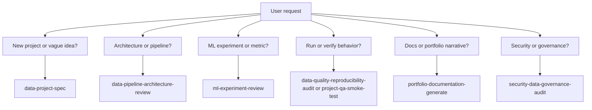

# Local Agents, Rules, And Skills

This directory defines the repository-specific operating system for AI-assisted
work in `Quantumquirkz/data-intelligence-engineering`.

It is inspired by the `garrytan/gstack` pattern: a virtual team of specialist
roles, reusable rules, and task-specific skills. The implementation here is
adapted for a Python data intelligence portfolio repository rather than copied
from a product/web deployment stack.

## Directory Map

```text
.agents/
  README.md
  agents/
    data-product-strategist.md
    data-platform-architect.md
    ml-research-scientist.md
    analytics-storyteller.md
    qa-reproducibility-auditor.md
    security-data-governance-officer.md
  rules/
    agent-routing-rules.md
    data-and-privacy-rules.md
    documentation-rules.md
    repository-operating-rules.md
    review-and-release-rules.md
    scientific-ml-quality-rules.md
  skills/
    data-project-spec/SKILL.md
    data-pipeline-architecture-review/SKILL.md
    ml-experiment-review/SKILL.md
    data-quality-reproducibility-audit/SKILL.md
    portfolio-documentation-generate/SKILL.md
    security-data-governance-audit/SKILL.md
    project-qa-smoke-test/SKILL.md
```

## Core Workflow


## Prompt Invocation Contract

Every prompt that asks for repository work should call the local operating
system explicitly. This makes the expected specialist role, policy layer, and
workflow unambiguous.

Use this format:

```text
Use agent: <specialist role>.
Apply rules: <comma-separated rule file stems>.
Invoke skill: <skill name>.
Task: <the concrete work>.
Evidence required: <how completion should be proven>.
```

Minimal example:

```text
Use agent: Data Platform Architect.
Apply rules: repository-operating-rules, scientific-ml-quality-rules.
Invoke skill: data-pipeline-architecture-review.
Task: Review the architecture of projects/renewable_energy_mix_optimizer.
Evidence required: findings with file references and a validation plan.
```

If a prompt omits this block, the assistant should infer it using
`rules/agent-routing-rules.md`, announce the inferred route in one sentence, and
continue with the task. The assistant should not require the user to memorize
the exact names.

## Invocation Reference

| Intent | Agent | Rules | Skill |
|---|---|---|---|
| New project idea or project scope | Data Product Strategist | repository-operating-rules, scientific-ml-quality-rules, documentation-rules | data-project-spec |
| Pipeline or architecture review | Data Platform Architect | repository-operating-rules, scientific-ml-quality-rules | data-pipeline-architecture-review |
| ML/statistical experiment review | ML Research Scientist | scientific-ml-quality-rules, data-and-privacy-rules | ml-experiment-review |
| Reproducibility or data quality audit | QA Reproducibility Auditor | data-and-privacy-rules, review-and-release-rules | data-quality-reproducibility-audit |
| Project smoke test | QA Reproducibility Auditor | repository-operating-rules, review-and-release-rules | project-qa-smoke-test |
| Documentation or portfolio writing | Analytics Storyteller | documentation-rules, repository-operating-rules | portfolio-documentation-generate |
| Security, privacy, or governance audit | Security Data Governance Officer | data-and-privacy-rules, review-and-release-rules | security-data-governance-audit |

## Specialist Roles

- **Data Product Strategist**: turns vague ideas into scoped portfolio projects.
- **Data Platform Architect**: designs pipelines, module boundaries, and
  execution flows.
- **ML Research Scientist**: evaluates experiment design, statistical validity,
  metrics, leakage, and model behavior.
- **Analytics Storyteller**: improves notebooks, charts, README narratives, and
  portfolio communication.
- **QA Reproducibility Auditor**: verifies that commands, notebooks, apps, and
  pipelines actually run.
- **Security Data Governance Officer**: audits secrets, privacy, dependency
  exposure, and data governance.

## Skill Selection

Use a skill when the user asks for a task that has a repeatable process. Skills
are written in a Codex-compatible `SKILL.md` shape with YAML frontmatter.



## Maintenance Rules

- Keep this system repository-specific.
- Do not vendor the full external `gstack` repository here.
- Add a new agent only when it represents a durable role.
- Add a new rule only when it applies across many tasks.
- Add a new skill only when the workflow is repeatable and benefits from a
  checklist.
- Update `.context/` when this operating model changes structurally.
