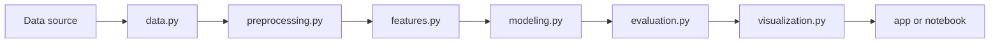

# Data Pipeline Architecture Review

Use this skill for architecture review before or after implementation.

## Required Context

Read:

- `.context/architecture.md`
- `.context/engineering-conventions.md`
- `.agents/agents/data-platform-architect.md`
- `.agents/rules/repository-operating-rules.md`

Then inspect the relevant project files.

## Review Dimensions

1. **Project shape**
   - Does the project follow the repository template?
   - Are notebooks, modules, data docs, and app entry points separated?

2. **Data flow**
   - Is the path from raw/simulated data to output explicit?
   - Are schema assumptions documented?
   - Are missingness, units, and time ordering handled?

3. **Module boundaries**
   - `data.py`: loading or generation.
   - `preprocessing.py`: cleaning and validation.
   - `features.py`: feature construction.
   - `modeling.py`: training and model objects.
   - `evaluation.py`: metrics and diagnostics.
   - `visualization.py`: charts and summaries.
   - `inference.py`: prediction or reusable inference interface.
   - `pipeline.py`: orchestration.

4. **Performance and memory**
   - Look for repeated expensive operations.
   - Check whether vectorization or streaming would matter.
   - Flag unnecessary large intermediate copies.

5. **Failure behavior**
   - Validate input checks.
   - Ensure errors are actionable.
   - Avoid silent fallback values that hide bad data.

6. **Reproducibility**
   - Seeds.
   - Deterministic splits.
   - Stable dependency path through `uv`.

## Required Diagram

For non-trivial reviews, include a Mermaid diagram:



## Output Format

Lead with findings:

```markdown
## Findings

1. [Severity] <Finding title> - <file:line if available>
   Impact:
   Evidence:
   Recommendation:

## Architecture Assessment
<Short synthesis.>

## Proposed Data Flow
<Mermaid diagram.>

## Validation Plan
- Command:
- Expected evidence:

## Residual Risk
- 
```

## Exit Criteria

The review is complete only when it identifies architecture risks, confirms or
proposes the pipeline shape, and names validation commands.
