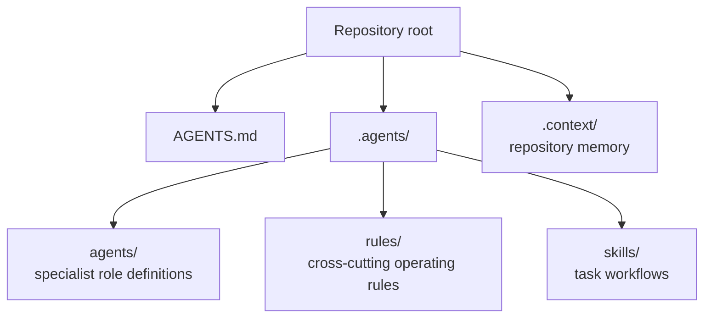
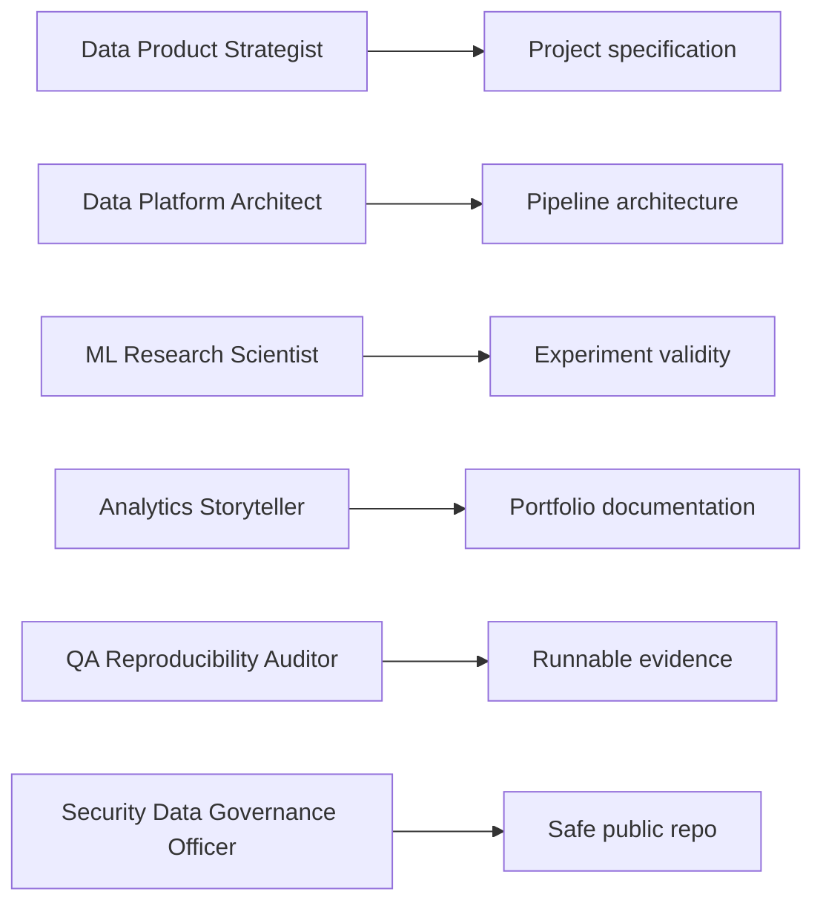

# Agent Operating System

This repository includes a local AI operating layer inspired by
`garrytan/gstack`: specialized agents, reusable rules, and task-specific skills.

The external `gstack` project is a broad AI engineering workflow suite with
roles for planning, engineering review, QA, security, documentation, release,
and operational memory. This repository does not vendor that full stack. Instead,
it adapts the useful pattern to the repository's actual domain: Python-based
data science, data engineering, analytics, ML engineering, scientific computing,
portfolio projects, and reproducibility.

## Local Files



## Design Intent

The local agent system exists to make AI-assisted changes more rigorous:

- Route work to a clear specialist mode.
- Make repeated workflows explicit.
- Protect reproducibility and data validity.
- Keep documentation aligned with code.
- Reduce generic AI behavior in favor of repository-specific judgment.

## Invocation Protocol

Every repository prompt should make the operating layer explicit when possible:

```text
Use agent: <agent title>.
Apply rules: <rule file stems>.
Invoke skill: <skill name>.
Task: <specific repository task>.
Evidence required: <proof expected before completion>.
```

If the prompt does not include this block, the assistant should infer the route
from `AGENTS.md` and `.agents/rules/agent-routing-rules.md`, then state the
selected route before working.

Examples:

```text
Use agent: Data Product Strategist.
Apply rules: repository-operating-rules, documentation-rules.
Invoke skill: data-project-spec.
Task: Specify a new project for climate trend attribution.
Evidence required: project thesis, data strategy, method, structure, and acceptance criteria.
```

```text
Use agent: QA Reproducibility Auditor.
Apply rules: review-and-release-rules, data-and-privacy-rules.
Invoke skill: project-qa-smoke-test.
Task: Smoke test projects/gravitational_orbit_simulator.
Evidence required: commands run, pass/fail result, and unverified areas.
```

## Role Model



## Skills

The `.agents/skills/` directory contains Codex-style `SKILL.md` workflows:

- `data-project-spec`
- `data-pipeline-architecture-review`
- `ml-experiment-review`
- `data-quality-reproducibility-audit`
- `portfolio-documentation-generate`
- `security-data-governance-audit`
- `project-qa-smoke-test`

These skills should be used when the user asks for repeatable work such as
creating a project spec, reviewing ML validity, auditing data quality, generating
documentation, or smoke-testing a project.

## Rules

Rules are stored in `.agents/rules/`:

- `repository-operating-rules.md`
- `data-and-privacy-rules.md`
- `scientific-ml-quality-rules.md`
- `documentation-rules.md`
- `review-and-release-rules.md`
- `agent-routing-rules.md`

Rules should be treated as durable policy for this repository. They are more
specific than generic coding style instructions and should be updated when the
repository's operating model changes.

## Relationship To `gstack`

Applicable ideas adapted from `gstack`:

- Specialist roles instead of one generic assistant mode.
- Explicit routing between planning, review, QA, docs, and security.
- Completion based on evidence, not intention.
- Review-first posture for risky changes.
- Documentation generation as a first-class workflow.

Ideas intentionally not adopted:

- Browser automation stack.
- Deployment/release automation for production web services.
- Full vendored external skill suite.
- Telemetry, updater, and global machine state.
- iOS and product-design-specific workflows that do not match this repository.

## Maintenance

When adding or changing agents, rules, or skills:

1. Keep `AGENTS.md` as the root router.
2. Update `.agents/README.md`.
3. Update this document if the structure changes.
4. Keep skill frontmatter accurate.
5. Validate Markdown paths and YAML frontmatter.
