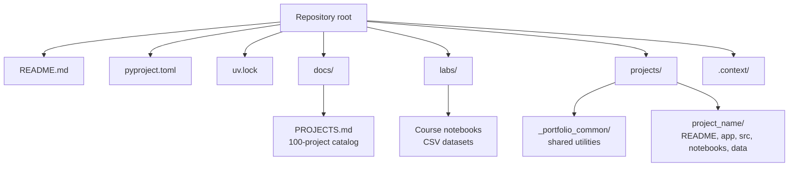
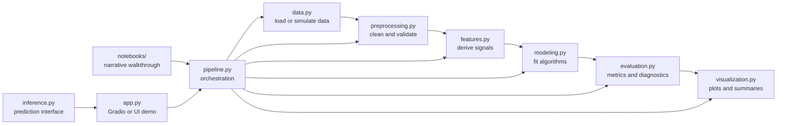
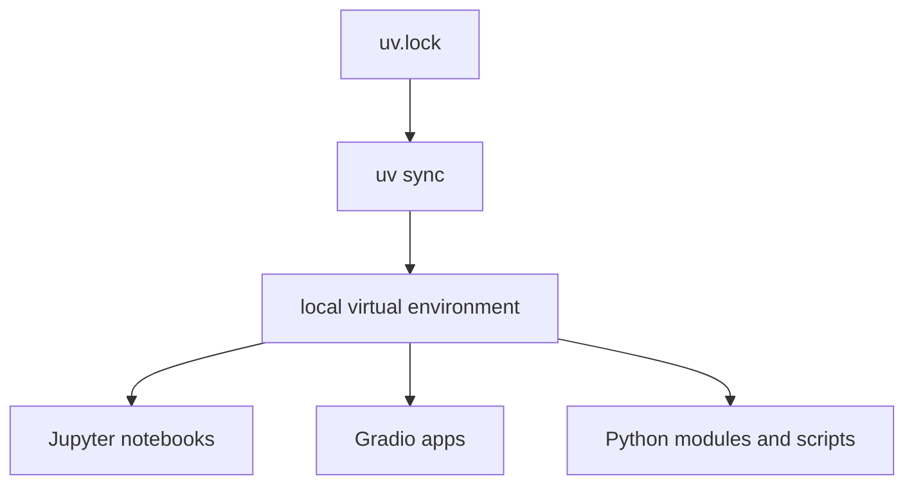

# Architecture

This repository follows a portfolio-lab architecture. The root contains shared
configuration and documentation, while projects and labs are organized as
independent learning and implementation units.

## Repository Layout



## Root-Level Responsibilities

- `README.md`: public-facing repository introduction, setup instructions, and
  high-level layout.
- `pyproject.toml`: Python project metadata and dependency declarations.
- `uv.lock`: locked dependency graph for reproducibility.
- `LICENSE`: MIT license.
- `docs/PROJECTS.md`: structured catalog of 100 project ideas and theoretical
  stacks.
- `.context/`: durable repository context for humans and AI systems.

## Project-Level Template

Most portfolio projects follow this structure:

```text
projects/<project_name>/
  README.md
  app.py
  data/
    README.md
  notebooks/
    <project_name>.ipynb
  src/
    __init__.py
    config.py
    data.py
    preprocessing.py
    features.py
    modeling.py
    evaluation.py
    visualization.py
    inference.py
    pipeline.py
```

Some projects may include domain-specific modules. For example,
`sensor_drift_detection` contains `drift_detection.py`, because drift detection
is a core domain concept rather than a generic modeling step.

## Standard Project Execution Flow



The pipeline module should be the primary composition layer. Notebooks and apps
should call pipeline functions instead of duplicating business logic.

## Shared Utility Layer

`projects/_portfolio_common/` contains reusable modules for standardized
portfolio projects:

- `data.py`
- `preprocessing.py`
- `features.py`
- `modeling.py`
- `evaluation.py`
- `visualization.py`
- `inference.py`
- `pipeline.py`
- `spec.py`

This shared layer reduces duplication across generated or template-aligned
projects. It should remain generic enough to support multiple domains, while
domain-specific assumptions should stay inside each project folder.

## Dependency Model

Dependencies are managed with `uv` through `pyproject.toml` and `uv.lock`.

Major dependency families include:

- Numerical computing: NumPy, SciPy, pandas, Polars, PyArrow.
- Machine learning: scikit-learn, XGBoost, LightGBM, SHAP, Optuna.
- Deep learning and NLP tooling: PyTorch, TensorFlow, transformers, datasets.
- Statistics and modeling: statsmodels.
- Visualization: matplotlib, seaborn, plotly.
- Interfaces and notebooks: Jupyter, JupyterLab, ipykernel, Gradio.
- Reporting and graph helpers: rich, tabulate, prettytable, pydot, graphviz.



## Architectural Assumptions

- The repository is primarily a learning and portfolio environment, not a
  single deployable production service.
- Projects should be independently understandable and runnable from the
  repository root.
- Public datasets, simulated datasets, or small local samples are preferred over
  large committed artifacts.
- Reproducibility matters more than ad hoc experimentation.
- Shared abstractions are valuable only when they reduce repeated structure
  across multiple projects.

## Known Structural Risks

- Many projects can make dependency management heavy; `uv.lock` should remain
  the source of truth for environment reproduction.
- Notebook-only logic can become difficult to test or reuse; project logic
  should live in `src/` modules.
- Generated project templates can drift from hand-built projects unless
  conventions are documented and periodically reviewed.
- Large data files should be avoided unless there is a clear reason and storage
  strategy.
