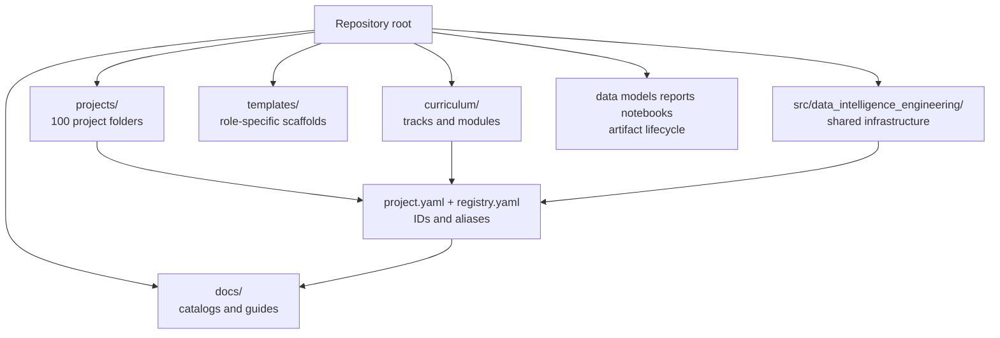

# Architecture

This repository follows a teaching-first, metadata-backed portfolio-lab
architecture. It is built to teach Data Analytics, Data Science, Data
Engineering, ML Engineering, and Scientific Computing through 100 practical
projects.

## System Shape

## Canonical Project Identity

- Physical project paths remain slug-based, for example
  `projects/sensor_drift_detection/`.
- Stable IDs `p001`-`p100` live in project metadata.
- `projects/registry.yaml` is the repository-wide index.
- Tooling resolves both IDs and slugs through the central registry.
- Symlink aliases and duplicated project folders are avoided.

## Teaching Layer

`curriculum/` is the learning map. It organizes role-based tracks and reusable
modules, but it does not duplicate project code. Track READMEs point learners to
project READMEs and notebooks.

Tracks:

- `data_analytics`
- `data_science`
- `data_engineering`
- `ml_engineering`
- `scientific_computing`

## Project Template Families

The repository uses multiple project shapes because analytics dashboards, data
pipelines, ML services, and scientific simulations have different natural
artifacts.

- `analytics_project`
- `data_science_project`
- `data_engineering_project`
- `ml_engineering_project`
- `scientific_computing_project`
- `capstone_project`

## Shared Core Boundary

`src/data_intelligence_engineering/` contains reusable infrastructure:

- catalog and registry loading;
- project metadata validation;
- shared path/config helpers;
- lightweight pipeline contracts;
- reusable data, modeling, evaluation, visualization, and app helpers.

Domain-specific logic remains inside each project.

## Artifact Lifecycle

Project-local `data/`, `notebooks/`, and reports remain valid for
self-contained execution. Top-level `data/`, `models/`, `reports/`,
`notebooks/`, and `references/` define shared repository standards and prepare
the repository for optional DVC adoption later.

## Operating Assumptions

- The repository is a public teaching and portfolio lab, not one monolithic
  production application.
- README files and notebooks are the main teaching surface.
- `uv`, `pyproject.toml`, and `uv.lock` define reproducible execution.
- Metadata-driven discovery is preferred over hard-coded flat filesystem
  assumptions.
