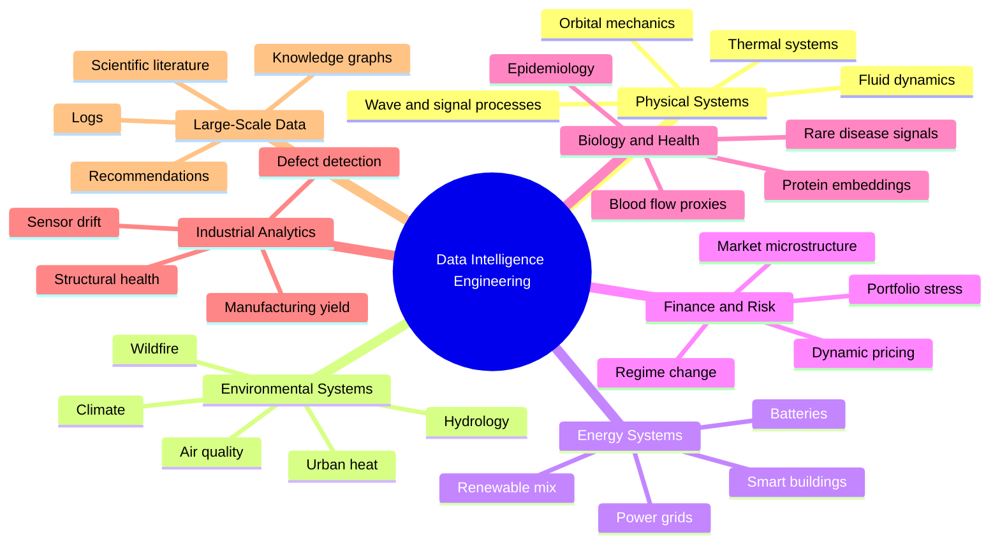
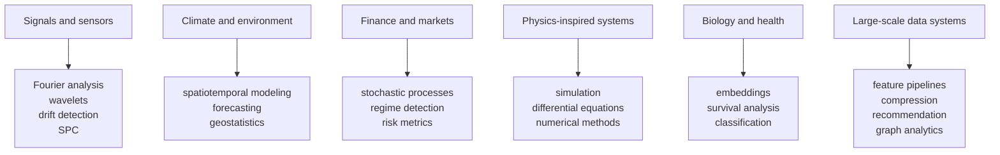

# Project Taxonomy

The repository contains a broad project catalog focused on data intelligence at
the intersection of applied data science, engineering, analytics, scientific
computing, and ML systems.

`docs/PROJECTS.md` defines 100 project ideas. The `projects/` directory contains
portfolio implementations and a shared utility layer. At the time this context
was created, `projects/` contained 101 top-level directories, including
`_portfolio_common`.

## Portfolio Families

## Representative Implemented Areas

The repository includes projects across domains such as:

- Industrial sensor drift detection.
- Seismic and signal classification.
- Solar irradiance and power grid load forecasting.
- Particle diffusion Monte Carlo simulation.
- High-frequency trading microstructure analysis.
- Gravitational orbit simulation.
- Protein folding embedding exploration.
- PDE-based image denoising.
- Semiconductor process variation analysis.
- Renewable energy mix optimization.
- Urban heat island analysis.
- Bayesian online experiment analysis.
- Sports biomechanics motion analysis.
- Experimental reproducibility analytics.

## Domain-To-Method Mapping

## Learning Progression

The repository can be read as a progression:

1. **Labs** introduce focused skills such as pandas, statistics, visualization,
   and Gradio.
2. **Individual projects** apply those skills to a coherent domain problem.
3. **Shared utilities** generalize repeated data science pipeline structure.
4. **Interactive apps** convert analysis into inspectable demos.
5. **Documentation and context** turn experiments into a navigable portfolio.

## Project Selection Principles

Good projects for this repository should:

- Have a clear data-generating process or domain story.
- Be reproducible with public, simulated, or lightweight local data.
- Include measurable outputs, not only visual exploration.
- Teach a technical concept from data science, engineering, analytics, or ML.
- Expose limitations and assumptions clearly.
- Fit the existing modular structure unless there is a strong reason to diverge.

## Scientific Framing

Many projects intentionally borrow concepts from scientific systems:

- **Physics** contributes conservation laws, dynamical systems, diffusion,
  waves, signal processing, and numerical simulation.
- **Biology and medicine** contribute population dynamics, embeddings,
  survival analysis, and noisy observational data.
- **Finance** contributes stochastic processes, regime shifts, tail risk, and
  decision-making under uncertainty.
- **Engineering** contributes control, reliability, fault detection, system
  monitoring, and operational constraints.
- **Mathematics** contributes optimization, probability, linear algebra,
  topology, differential equations, and statistical inference.

This interdisciplinary framing is a core part of the repository's identity.
