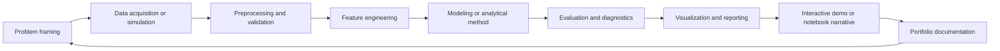

# Repository Overview

Repository: **Quantumquirkz/data-intelligence-engineering**  
Author: **Jhuomar Boskoll Quintero**  
Primary language: **Python**  
License: **MIT**  
Package manager: **uv**  
Python target: **3.12+**

## Mission

`data-intelligence-engineering` is a practical repository for Data Science,
Data Engineering, Data Analytics, and ML Engineering projects, workflows, tools,
experiments, and end-to-end solutions built for learning and real-world impact.

The repository is designed as a living portfolio and applied laboratory. It
connects exploratory notebooks, reusable Python modules, datasets, demos,
scientific modeling, machine learning, and analytical reporting into a single
workspace. Its value is not only in isolated examples, but in the repeated
pattern of turning a data problem into a reproducible system.

## Repository Identity

This repository should be understood as a multidisciplinary data intelligence
workbench. It combines:

- **Data Science**: statistical reasoning, feature engineering, model
  evaluation, uncertainty, interpretability, and scientific experimentation.
- **Data Engineering**: reproducible environments, structured project layouts,
  data loading, transformations, tabular workflows, and scalable processing
  patterns where appropriate.
- **Data Analytics**: exploratory analysis, charts, reporting tables,
  communication artifacts, and interactive demos.
- **ML Engineering**: modular pipelines, model training, evaluation,
  inference-oriented interfaces, and workflow repeatability.
- **Scientific Computing**: projects inspired by physics, biology, finance,
  climate, signal processing, energy systems, dynamical systems, and numerical
  modeling.

## Intended Audience

The repository is useful for:

- The author, as a long-term technical portfolio and learning system.
- Data science and ML engineering learners who want concrete project patterns.
- Recruiters or technical reviewers who need evidence of applied breadth.
- Collaborators who want a modular structure for experiments and demos.
- AI coding agents that need repository-level context before proposing changes.

## Design Philosophy

The repository favors a systems-engineering mindset:

- Problems are decomposed into data, features, models, evaluation, inference,
  visualization, and presentation.
- Projects are kept self-contained while still allowing shared utilities through
  `projects/_portfolio_common`.
- Notebooks explain and validate workflows, but reusable logic belongs in
  Python modules.
- Interactive apps make results easier to inspect, especially for portfolio and
  teaching use cases.
- Theoretical grounding matters: projects often connect data workflows with
  mathematical, physical, biological, or economic systems.

## High-Level Workflow

This loop reflects the repository's applied nature. A project is not complete
when a model runs once; it becomes useful when the assumptions, data behavior,
metrics, limitations, and reproducible execution path are visible.

## Current Repository Shape

The repository currently contains:

- `README.md` as the public entry point.
- `pyproject.toml` and `uv.lock` for reproducible Python dependency management.
- `docs/PROJECTS.md` as the original catalog of 100 multidisciplinary project
  ideas.
- `docs/project_catalog.md` and `docs/catalog/` as generated metadata-backed
  catalog views.
- `curriculum/` for role-based teaching tracks and reusable modules.
- `labs/` for course-oriented notebooks, workshops, exercises, and mini cases.
- `projects/` for 100 portfolio projects with slug-based physical paths and
  stable `p001`-`p100` metadata IDs.
- `projects/_portfolio_common/` for shared utilities used by generated or
  standardized portfolio projects.
- `templates/` for role-specific project scaffolds.
- Individual project folders with a repeated shape: `project.yaml`,
  `README.md`, `app.py`, `notebooks/`, `src/`, and `data/`.

## Strategic Role Of `.context`

The `.context` directory is the repository's persistent memory layer. It should
capture architectural intent, naming conventions, operating assumptions, and
scientific/engineering standards at a level above any single project.

This allows future work to remain aligned with the repository's mission:
practical, rigorous, reproducible, multidisciplinary data intelligence.
