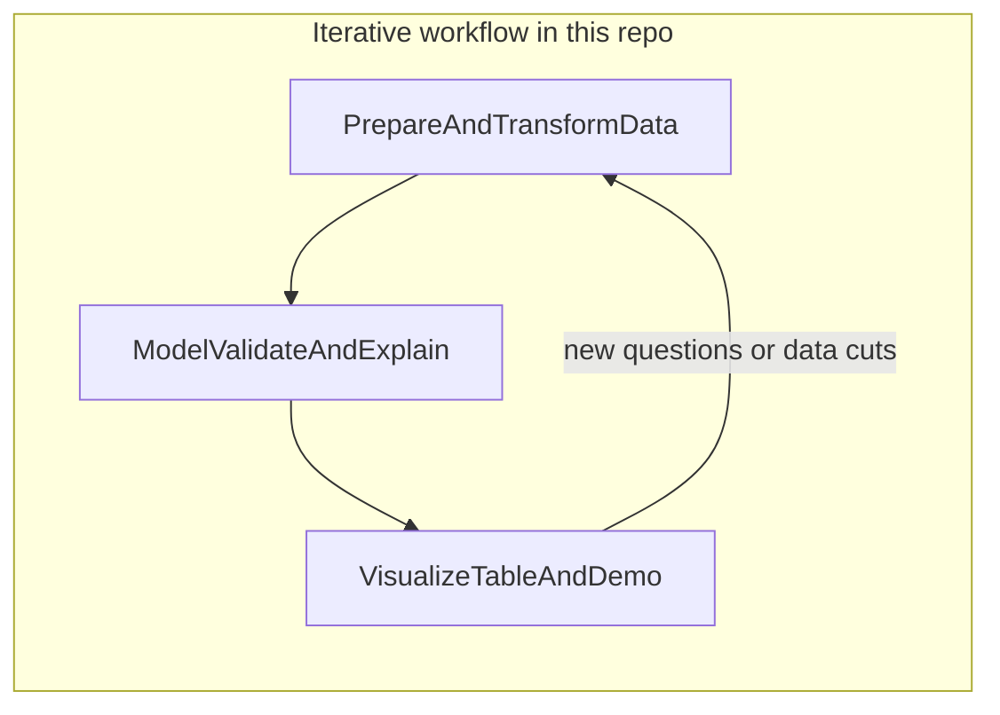
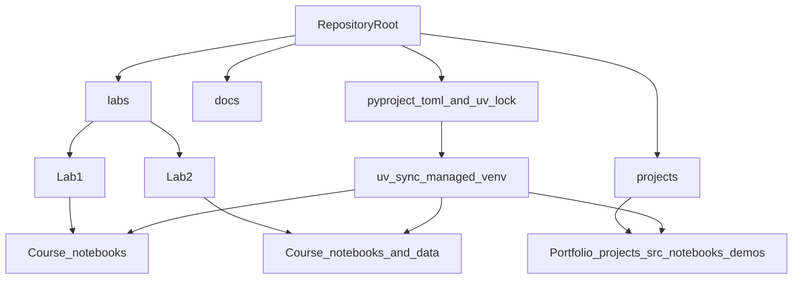

# Data Science — Engineer — Analytics

A Python workspace for **data science**, **data engineering**, and **analytics**: exploratory analysis, reproducible modeling, scalable tabular processing, experimentation, and shareable demos.

## About this repository

This repository is a practical lab for turning raw or structured data into insight and systems you can iterate on. It is organized around three overlapping areas:

- **Data science** — Formulating questions, building and validating models, statistical reasoning, and interpretability (including classic ML, gradient boosting, and neural approaches when needed).
- **Data engineering (lightweight, in-repo)** — Working efficiently with datasets at the notebook-and-script level: loading and transforming tabular data, using columnar tools, and keeping dependencies pinned so workflows are reproducible.
- **Analytics** — Visualization, reporting-style tables, and lightweight interfaces so results are easy to explore and communicate.

### How the pieces fit together





**`labs/`** holds **course labs** (Lab 1, Lab 2, …). **`projects/`** holds **portfolio-style** work: modular `src/` code, notebooks, data, and Gradio demos (for example **`projects/sensor_drift_detection/`** and **`projects/seismic_signal_classification/`**). Supporting material lives in **`docs/`**; the repository root keeps configuration and this README.

## Repository layout

- **`labs/`** — Course lab notebooks and related assets (statistics, Gradio, pandas, etc.).
- **`labs/Lab1/`** — First lab; start with `Lab1_Gradio.ipynb` for interactive demos with Gradio.
- **`labs/Lab2/`** — Second lab; see `Lab2_EstadisticaPandas.ipynb` and bundled CSV datasets for pandas and statistics exercises.
- **`projects/`** — Self-contained portfolio projects (pipelines, `src/`, notebooks, optional `app.py`).
- **`projects/sensor_drift_detection/`** — Modular portfolio project for industrial drift detection.
- **`projects/seismic_signal_classification/`** — Modular geophysical signal-classification project with preprocessing, features, modeling, notebook, and Gradio demo.
- **`projects/solar_irradiance_forecasting/`** — Short-term GHI forecasting with Open-Meteo data, solar geometry features, LightGBM quantiles, notebook, and Gradio demo.
- **`projects/power_grid_load_forecasting/`** — Regional hourly load (OPSD) with weather, holidays, SARIMAX benchmark, LightGBM quantiles, optimized ensemble, notebook, and Gradio demo.
- **`projects/particle_diffusion_mc/`** — Brownian motion Monte Carlo, heat-kernel comparison, MSD and Rayleigh diagnostics, notebook, and Gradio demo.
- **`docs/PROJECTS.md`** — Project idea catalog and supporting reference material.
- **`pyproject.toml`** — Project metadata and Python dependencies (managed with **uv**).
- **`uv.lock`** — Locked versions for reproducible installs.
- **`.python-version`** — Target Python version for local tooling (see Prerequisites).
- **`LICENSE`** — MIT License terms.

A local **`.venv/`** may appear after you run `uv sync`; it is not part of the canonical repository layout and is typically gitignored.

## Tech stack

Dependencies are declared in `pyproject.toml` and grouped below by role. Versions are resolved via **`uv.lock`**.

**Core data and numerics**

- NumPy, SciPy  
- pandas, Polars, PyArrow  
- openpyxl (spreadsheet I/O)  
- tqdm (progress)

**Statistics and classical machine learning**

- scikit-learn  
- statsmodels  
- XGBoost, LightGBM  
- SHAP (interpretability)

**Deep learning and NLP-style tooling**

- PyTorch (with torchvision, torchaudio; CPU wheel index configured in `pyproject.toml`)  
- TensorFlow  
- Hugging Face ecosystem: `transformers`, `datasets`, `accelerate`, `sentencepiece`

**Experimentation and optimization**

- Optuna

**Visualization, formatting, and graph helpers**

- matplotlib, seaborn, plotly  
- rich (terminal output)  
- tabulate, prettytable  
- pydot, graphviz (Python bindings; see Prerequisites for system Graphviz)

**Notebooks, kernels, and interfaces**

- Jupyter, JupyterLab, ipykernel  
- Gradio  
- CustomTkinter

## Prerequisites

- **Python 3.12+** (see `requires-python` in `pyproject.toml` and `.python-version`).
- **[uv](https://github.com/astral-sh/uv)** — recommended for installing dependencies and running commands in the project environment.

**Optional — system Graphviz**  
If you render graphs to files (for example PNG or SVG) using **pydot** or the **graphviz** Python package, install the Graphviz **system** tools so the `dot` executable is available (e.g. on Debian/Ubuntu: `sudo apt install graphviz`).

## Getting started

Clone the repository and install locked dependencies:

```bash
git clone https://github.com/Quantumquirkz/Data-Science---Engineer---Analytics.git
cd Data-Science---Engineer---Analytics
uv sync
```

This project sets **`[tool.uv] index-strategy = "unsafe-best-match"`** in `pyproject.toml` so resolution can combine the PyTorch CPU wheel index with PyPI cleanly when locking and syncing.

Quick sanity checks:

```bash
uv run python -c "import pandas, gradio; print('environment ready')"
```

## Notebooks and demos

For interactive work, open **JupyterLab** from the project environment:

```bash
uv run jupyter lab
```

Then open **`labs/Lab1/Lab1_Gradio.ipynb`** or **`labs/Lab2/Lab2_EstadisticaPandas.ipynb`** for course labs, or explore project notebooks such as **`projects/sensor_drift_detection/notebooks/sensor_drift_detection.ipynb`** and **`projects/seismic_signal_classification/notebooks/seismic_signal_classification.ipynb`**. Individual notebooks may launch Gradio apps or other interfaces as described in their own cells.

## License

This project is licensed under the **MIT License** — see [LICENSE](LICENSE).

Copyright (c) 2026 Jhuomar Boskoll Quintero.
