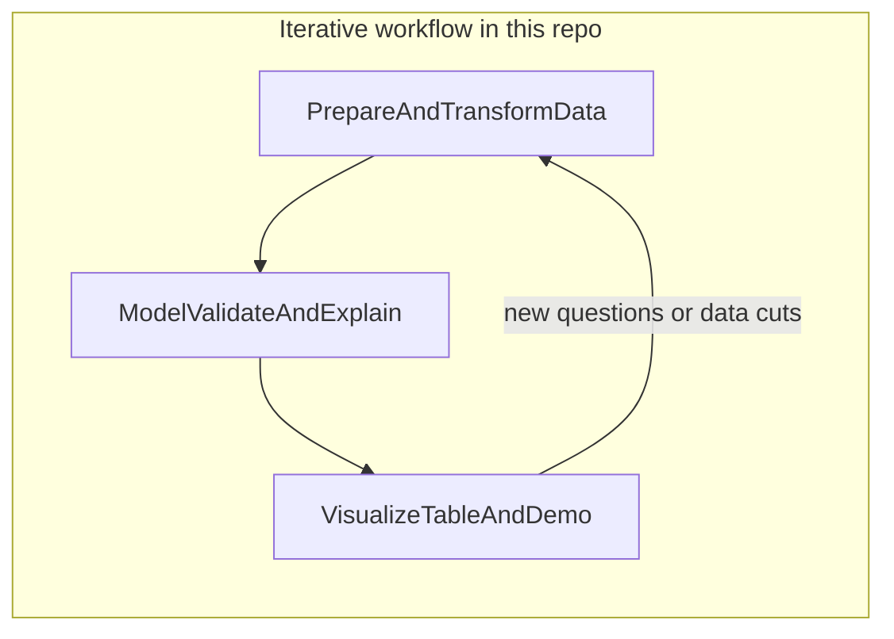
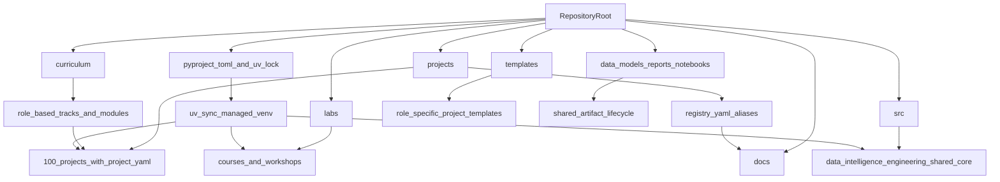

# Data Science — Engineer — Analytics

A Python workspace for **data analytics**, **data science**, **data engineering**, **ML engineering**, and **scientific computing**: exploratory analysis, reproducible modeling, scalable tabular processing, experimentation, and shareable demos.

## About this repository

This repository is a practical lab for turning raw or structured data into insight and systems you can iterate on. It is organized around three overlapping areas:

- **Data Analytics** — Visualization, reporting-style tables, metrics, dashboards, and lightweight interfaces so results are easy to explore and communicate.
- **Data Science** — Formulating questions, building and validating models, statistical reasoning, and interpretability.
- **Data Engineering** — Loading, validating, transforming, and organizing data workflows with reproducible project conventions.
- **ML Engineering** — Training pipelines, evaluation, inference interfaces, compatibility checks, and operational patterns.
- **Scientific Computing** — Physics-inspired simulation, numerical reasoning, uncertainty, and scientific visualization.

### How the pieces fit together





**`curriculum/`** maps role-based learning tracks to the 100 projects. **`labs/`** holds course labs and workshops. **`projects/`** holds portfolio-style work with stable metadata IDs `p001`-`p100` while preserving slug-based paths. **`templates/`** contains role-specific project templates. **`src/data_intelligence_engineering/`** holds repository-wide shared infrastructure. Supporting material lives in **`docs/`**, while top-level **`data/`**, **`models/`**, **`reports/`**, and **`notebooks/`** define shared artifact lifecycle standards.

## Repository layout

- **`curriculum/`** — Role-based learning paths and reusable modules for Data Analytics, Data Science, Data Engineering, ML Engineering, and Scientific Computing.
- **`labs/`** — Course lab notebooks and related assets (statistics, Gradio, pandas, etc.).
- **`labs/courses/`** — Stable aliases for the lab sequence, preserved alongside the historical `Lab1`, `Lab2`, `Lab3`, and `Lab5` paths during migration.
- **`labs/workshops/`** — Topic-grouped workshop material; `Workshops/` remains as a compatibility surface while paths transition.
- **`labs/Lab1/`** — First lab; start with `Lab1_Gradio.ipynb` for interactive demos with Gradio.
- **`labs/Lab2/`** — Second lab; see `Lab2_EstadisticaPandas.ipynb` and bundled CSV datasets for pandas and statistics exercises.
- **`src/data_intelligence_engineering/`** — Shared repository core for catalog metadata, pipeline infrastructure, reusable data utilities, modeling helpers, and future cross-project tooling.
- **`projects/`** — 100 self-contained portfolio projects. Physical paths remain slug-based, while `project.yaml` and `projects/registry.yaml` provide stable IDs and alias-based discovery.
- **`templates/`** — Role-specific project templates for analytics, data science, data engineering, ML engineering, scientific computing, and capstones.
- **`projects/sensor_drift_detection/`** — Modular portfolio project for industrial drift detection.
- **`projects/seismic_signal_classification/`** — Modular geophysical signal-classification project with preprocessing, features, modeling, notebook, and Gradio demo.
- **`projects/solar_irradiance_forecasting/`** — Short-term GHI forecasting with Open-Meteo data, solar geometry features, LightGBM quantiles, notebook, and Gradio demo.
- **`projects/power_grid_load_forecasting/`** — Regional hourly load (OPSD) with weather, holidays, SARIMAX benchmark, LightGBM quantiles, optimized ensemble, notebook, and Gradio demo.
- **`projects/particle_diffusion_mc/`** — Brownian motion Monte Carlo, heat-kernel comparison, MSD and Rayleigh diagnostics, notebook, and Gradio demo.
- **`projects/_portfolio_common/`** — Compatibility layer re-exporting the new shared core so existing generated project imports continue to work.
- **`data/`, `models/`, `reports/`, `notebooks/`** — Repository-level lifecycle surfaces for shared data, artifacts, outputs, and cross-project notebooks.
- **`tests/`** — Unit, integration, and smoke checks for the shared core and selected projects.
- **`configs/`** — Repository defaults, logging, project grouping metadata, and the allowed `project.yaml` schema values.
- **`references/`** — Shared notes for datasets, papers, and glossaries.
- **`docs/project_catalog.md`** and **`docs/catalog/`** — Generated metadata-backed catalog views by track, domain, difficulty, artifact, and template.
- **`docs/PROJECTS.md`** — Original project idea catalog and supporting reference material.
- **`pyproject.toml`** — Project metadata and Python dependencies (managed with **uv**).
- **`uv.lock`** — Locked versions for reproducible installs.
- **`.python-version`** — Target Python version for local tooling (see Prerequisites).
- **`LICENSE`** — MIT License terms.

A local **`.venv/`** may appear after you run `uv sync`; it is not part of the canonical repository layout and is typically gitignored.

## Tech stack

Dependencies are declared in `pyproject.toml` and grouped below by role. Versions are resolved via **`uv.lock`**.

**Core data and numerics**

- NumPy, SciPy  
- pandas, Polars, PyArrow  
- openpyxl (spreadsheet I/O)  
- tqdm (progress)

**Statistics and classical machine learning**

- scikit-learn  
- statsmodels  
- XGBoost, LightGBM  
- SHAP (interpretability)

**Deep learning and NLP-style tooling**

- PyTorch (with torchvision, torchaudio; CPU wheel index configured in `pyproject.toml`)  
- TensorFlow  
- Hugging Face ecosystem: `transformers`, `datasets`, `accelerate`, `sentencepiece`

**Experimentation and optimization**

- Optuna

**Visualization, formatting, and graph helpers**

- matplotlib, seaborn, plotly  
- rich (terminal output)  
- tabulate, prettytable  
- pydot, graphviz (Python bindings; see Prerequisites for system Graphviz)

**Notebooks, kernels, and interfaces**

- Jupyter, JupyterLab, ipykernel  
- Gradio  
- CustomTkinter

## Prerequisites

- **Python 3.12+** (see `requires-python` in `pyproject.toml` and `.python-version`).
- **[uv](https://github.com/astral-sh/uv)** — recommended for installing dependencies and running commands in the project environment.

**Optional — system Graphviz**  
If you render graphs to files (for example PNG or SVG) using **pydot** or the **graphviz** Python package, install the Graphviz **system** tools so the `dot` executable is available (e.g. on Debian/Ubuntu: `sudo apt install graphviz`).

## Getting started

Clone the repository and install locked dependencies:

```bash
git clone https://github.com/Quantumquirkz/data-intelligence-engineering.git
cd data-intelligence-engineering
uv sync
```

This project sets **`[tool.uv] index-strategy = "unsafe-best-match"`** in `pyproject.toml` so resolution can combine the PyTorch CPU wheel index with PyPI cleanly when locking and syncing.

Quick sanity checks:

```bash
uv run python -c "import pandas, gradio; print('environment ready')"
PYTHONPATH=src:. uv run python scripts/validate_project_structure.py
PYTHONPATH=src:. uv run python scripts/generate_project_catalog.py --check
```

## Notebooks and demos

For interactive work, open **JupyterLab** from the project environment:

```bash
uv run jupyter lab
```

Then open **`labs/Lab1/Lab1_Gradio.ipynb`** or **`labs/Lab2/Lab2_EstadisticaPandas.ipynb`** for course labs, or explore project notebooks such as **`projects/sensor_drift_detection/notebooks/sensor_drift_detection.ipynb`** and **`projects/seismic_signal_classification/notebooks/seismic_signal_classification.ipynb`**. Individual notebooks may launch Gradio apps or other interfaces as described in their own cells.

For architecture validation and lightweight compatibility checks:

```bash
PYTHONPATH=src:. uv run python scripts/run_smoke_checks.py
```

## License

This project is licensed under the **MIT License** — see [LICENSE](LICENSE).

Copyright (c) 2026 Jhuomar Boskoll Quintero.
