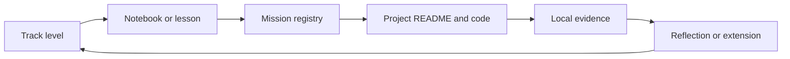

# Curriculum

This directory is the teaching operating system for the repository.

It organizes **five independent role tracks**, each with **ten levels**, while keeping the 100 portfolio projects in their existing slug-based folders. The system is teaching-first, mission-linked, self-paced, and open-source by design.

## Tracks

- [Data Analytics](tracks/data_analytics/README.md)
- [Data Science](tracks/data_science/README.md)
- [Data Engineering](tracks/data_engineering/README.md)
- [ML Engineering](tracks/ml_engineering/README.md)
- [Scientific Computing](tracks/scientific_computing/README.md)

## Core Documents

- [Framework](framework/README.md)
- [Learning Pathways](pathways/README.md)
- [Foundational Body Of Knowledge](foundational_body_of_knowledge.md)
- [Study Plan](study_plan.md)
- [Bibliography And Reference Spine](bibliography.md)

## Mission Graph

## Current Implementation Status

- All five tracks expose implemented L01-L10 level surfaces.
- Every level has a central notebook, syllabus, README, and mission mapping.
- Project-local notebooks remain the applied depth layer behind each mission.
