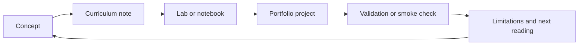

# Curriculum

This directory is the teaching map for the repository. It organizes the 100
portfolio projects into role-based learning tracks without duplicating project
folders.

The curriculum is designed from first principles: mathematics, programming,
data representation, statistics, machine learning, data engineering, ML
engineering, and scientific computing all reinforce each other. A learner should
be able to move from a concept, to a notebook, to a project, to a reproducible
portfolio artifact.

## Tracks

- `data_analytics` - metrics, reporting, exploratory analysis, dashboards, and communication.
- `data_science` - statistics, feature engineering, machine learning, evaluation, and interpretation.
- `data_engineering` - ingestion, schemas, validation, transformations, and scalable data workflows.
- `ml_engineering` - training pipelines, inference interfaces, reproducibility, and operational patterns.
- `scientific_computing` - numerical simulation, physics-inspired modeling, uncertainty, and scientific visualization.

## Operating Model

Projects remain under `projects/<slug>/`. Stable IDs such as `p001` live in each `project.yaml` and in `projects/registry.yaml`.

## Core Curriculum Documents

- [Foundational Body Of Knowledge](foundational_body_of_knowledge.md) -
  detailed conceptual spine from mathematical and programming fundamentals to
  capstone systems.
- [Study Plan](study_plan.md) - phase-based route from orientation to portfolio
  critique.
- [Bibliography And Reference Spine](bibliography.md) - authoritative sources
  used to expand the curriculum and validate explanations.

## Learning Loop

## Study Principle

Every concept should eventually connect to one of three artifacts:

- a notebook that teaches or explores it;
- a project that implements it;
- a validation check that proves the implementation is reproducible.
