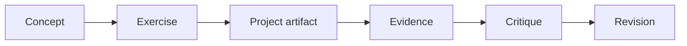

# Assessments

Assessment prompts and project checkpoints for the role-based tracks.

The repository should not evaluate learning only by whether a notebook runs.
The standard is stronger: a learner should be able to explain assumptions,
produce reproducible evidence, identify failure modes, and connect results to a
domain question.

## Assessment Philosophy

Each assessment should include:

- **Concept**: the principle being tested.
- **Task**: the concrete action to perform.
- **Evidence**: file, command, figure, table, metric, or explanation.
- **Failure mode**: what a weak answer would miss.
- **Revision path**: what to improve next.

## Module Checkpoints

| Module | Required Evidence | Common Failure |
| --- | --- | --- |
| Foundations | Explain observation, feature, target, metric, and assumption for one project | Treating a project as a topic instead of a measurable question |
| Python Data Stack | Load a dataset, inspect schema/missingness, and move one transformation into a function | Keeping all logic hidden in notebook cells |
| SQL And Analytics | Define a metric contract and segment it across at least two dimensions | Reporting a chart without defining the metric |
| Statistics And Experiments | Estimate an effect or difference with uncertainty and limitations | Treating correlation as causation |
| Machine Learning | Train a baseline and a model with appropriate validation | Reporting one score without leakage checks |
| Data Pipelines | Draw a DAG and validate schema/row-count/null-rate checks | Building transformations with no data contract |
| Big Data And Cloud Patterns | Explain partitioning, scaling bottlenecks, and local/cloud boundary | Assuming larger data only means larger hardware |
| MLOps And Serving | Define training, evaluation, inference, monitoring, and rollback artifacts | Treating model training as the end of the system |
| Scientific Computing | Validate a simulation against an invariant or limiting case | Trusting a smooth plot without numerical checks |
| Capstone Systems | Integrate question, data, pipeline, method, evaluation, and limitations | Building a larger notebook without system boundaries |

## Track Assessments

### Data Analytics

Deliver a one-page analytical memo:

- metric definition;
- data quality notes;
- segmented comparison;
- chart with interpretation;
- decision or next measurement;
- limitation.

### Data Science

Deliver a modeling report:

- task framing;
- leakage audit;
- baseline;
- validation design;
- model comparison;
- error analysis;
- limitations.

### Data Engineering

Deliver a data pipeline contract:

- source and schema;
- transformation DAG;
- quality checks;
- partition or scaling strategy;
- lineage;
- rerun/backfill notes.

### ML Engineering

Deliver a model lifecycle card:

- training command;
- data and feature contract;
- evaluation gate;
- inference interface;
- monitoring signals;
- rollback or retirement criteria.

### Scientific Computing

Deliver a simulation validation note:

- state variables and parameters;
- units and assumptions;
- numerical method;
- stability or resolution note;
- invariant or limiting-case check;
- sensitivity result.

## Scoring Levels

| Level | Description |
| --- | --- |
| 1 - Runs | The notebook or command executes, but assumptions are not explained. |
| 2 - Describes | The learner explains data, method, and output at a surface level. |
| 3 - Validates | The learner checks data quality, metrics, uncertainty, or numerical behavior. |
| 4 - Critiques | The learner identifies limitations and failure modes. |
| 5 - Extends | The learner proposes a defensible next experiment or system improvement. |
