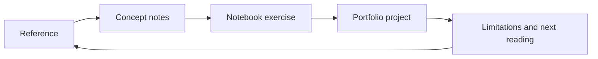

# Bibliography And Reference Spine

This bibliography anchors the curriculum to public, authoritative learning
materials. It is not exhaustive. It is the reference spine used to expand the
repository from simple project READMEs into a structured learning system.

## Mathematics

- Deisenroth, Faisal, and Ong, *Mathematics for Machine Learning*.
  Official companion site: https://mml-book.com/
- OpenStax, *Calculus Volume 1*.
  Official textbook page: https://openstax.org/details/books/calculus-volume-1

## Statistics And Experimental Reasoning

- OpenStax, *Introductory Statistics 2e*.
  Official textbook page:
  https://openstax.org/details/books/introductory-statistics-2e

## Python And Scientific Python

- Python Software Foundation, *The Python Tutorial*:
  https://docs.python.org/3/tutorial/index.html
- NumPy Developers, *NumPy User Guide*:
  https://numpy.org/doc/stable/user/index.html
- pandas Developers, *pandas User Guide*:
  https://pandas.pydata.org/docs/user_guide/index.html
- Scientific Python Developers, *Scientific Python Lectures*:
  https://lectures.scientific-python.org/

## Visualization And Analytical Communication

- Matplotlib Developers, *Using Matplotlib*:
  https://matplotlib.org/stable/users/index.html
- seaborn Developers, *User guide and tutorial*:
  https://seaborn.pydata.org/tutorial.html
- Plotly, *Python Graphing Library*:
  https://plotly.com/python/

## Machine Learning

- scikit-learn Developers, *User Guide*:
  https://scikit-learn.org/stable/user_guide.html
- scikit-learn Developers, *Choosing the right estimator*:
  https://scikit-learn.org/stable/machine_learning_map.html
- Stanford CS229, *Machine Learning Lecture Notes*:
  https://cs229.stanford.edu/main_notes.pdf
- Google for Developers, *Machine Learning Crash Course*:
  https://developers.google.com/machine-learning/crash-course

## Data Engineering And Workflow Orchestration

- Apache Airflow, *Core Concepts*:
  https://airflow.apache.org/docs/apache-airflow/stable/core-concepts/index.html
- Apache Airflow, *DAGs*:
  https://airflow.apache.org/docs/apache-airflow/stable/core-concepts/dags.html
- DVC, *Get Started with DVC*:
  https://doc.dvc.org/start

## ML Engineering And Model Lifecycle

- MLflow, *Documentation*:
  https://mlflow.org/docs/latest/
- MLflow, *Experiment Tracking*:
  https://mlflow.org/docs/latest/ml/tracking/
- MLflow, *Model Registry*:
  https://mlflow.org/docs/latest/ml/model-registry/

## How To Use These References

For each module, the learner should read only the sections needed for the next
project. The repository should avoid turning bibliography into passive reading:
each reference should connect to a notebook, a project, or a validation task.
