# Foundational Body Of Knowledge

This document is the starting theoretical layer for the repository curriculum.
It explains what a learner must understand before the 100 projects become more
than isolated examples. The repository is multidisciplinary, so the foundation
must connect mathematics, programming, analytics, engineering, machine learning,
and scientific computing.

The goal is not to memorize every concept before building. The goal is to know
which concept controls which failure mode: bad data creates bad conclusions,
weak statistics creates false confidence, weak software structure creates
unreproducible notebooks, and weak numerical reasoning creates simulations that
look plausible but are physically wrong.

## Curriculum Map

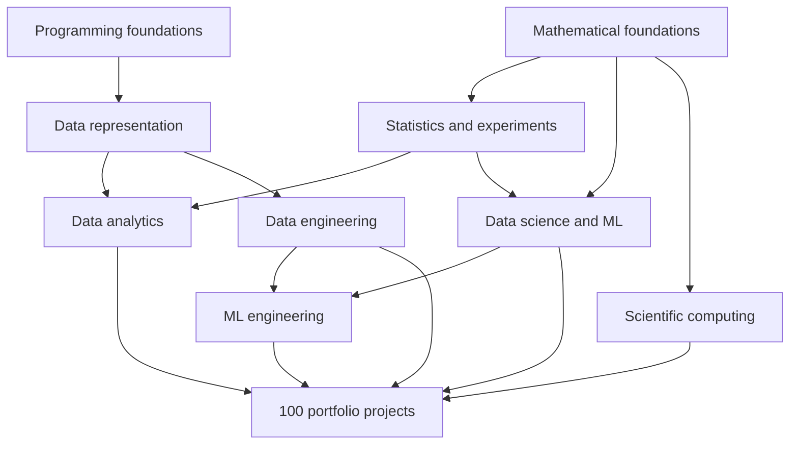

## 1. Mathematical Foundations

Mathematics is the language that makes data work auditable. A learner does not
need advanced abstraction on day one, but they do need enough algebra,
functions, probability, and geometry to understand what code is doing.

### Core Ideas

- **Algebra**: variables, equations, inequalities, exponents, logarithms,
  ratios, proportions, and units. These appear in normalization, growth rates,
  loss functions, and physical scaling laws.
- **Functions**: a function maps inputs to outputs. In analytics, a metric is a
  function of data. In ML, a model is a learned function. In simulation, an
  update rule is a function that moves a system through time.
- **Vectors and matrices**: tabular data is naturally represented as matrices:
  rows are observations, columns are variables, and vector operations allow
  efficient computation.
- **Calculus**: derivatives describe change and sensitivity; gradients point in
  directions of steepest increase; integrals aggregate continuous quantities.
- **Probability**: probability models uncertainty. It is required for sampling,
  confidence, risk, Bayesian reasoning, noise, and stochastic simulation.
- **Optimization**: many data problems reduce to choosing parameters that
  minimize error or maximize utility under constraints.

### Minimal Mathematical Pipeline

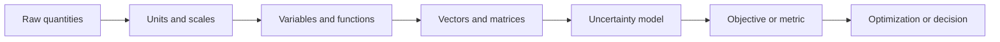

### What To Practice

- Convert a word problem into variables and units.
- Sketch the input-output relationship before coding.
- Represent a small dataset as a matrix.
- Compute a mean, variance, covariance, and correlation by hand at least once.
- Explain the difference between deterministic error and random noise.
- Describe what a model is optimizing and what it is ignoring.

## 2. Programming Foundations

Programming is not just syntax. It is the discipline of representing ideas as
state, functions, modules, tests, and reproducible commands.

### Core Ideas

- **State**: values stored in memory: numbers, strings, lists, dictionaries,
  arrays, DataFrames, models, paths, and configurations.
- **Control flow**: conditionals and loops decide what code runs and how many
  times it runs.
- **Functions**: reusable transformations with explicit inputs and outputs.
- **Modules**: files that group related functions and prevent notebooks from
  becoming the only source of truth.
- **Errors**: exceptions are signals. Good data code should fail loudly when
  assumptions are violated.
- **Reproducibility**: commands, dependency versions, seeds, and file paths must
  be explicit enough for another person to repeat the result.

### Repository Programming Pattern

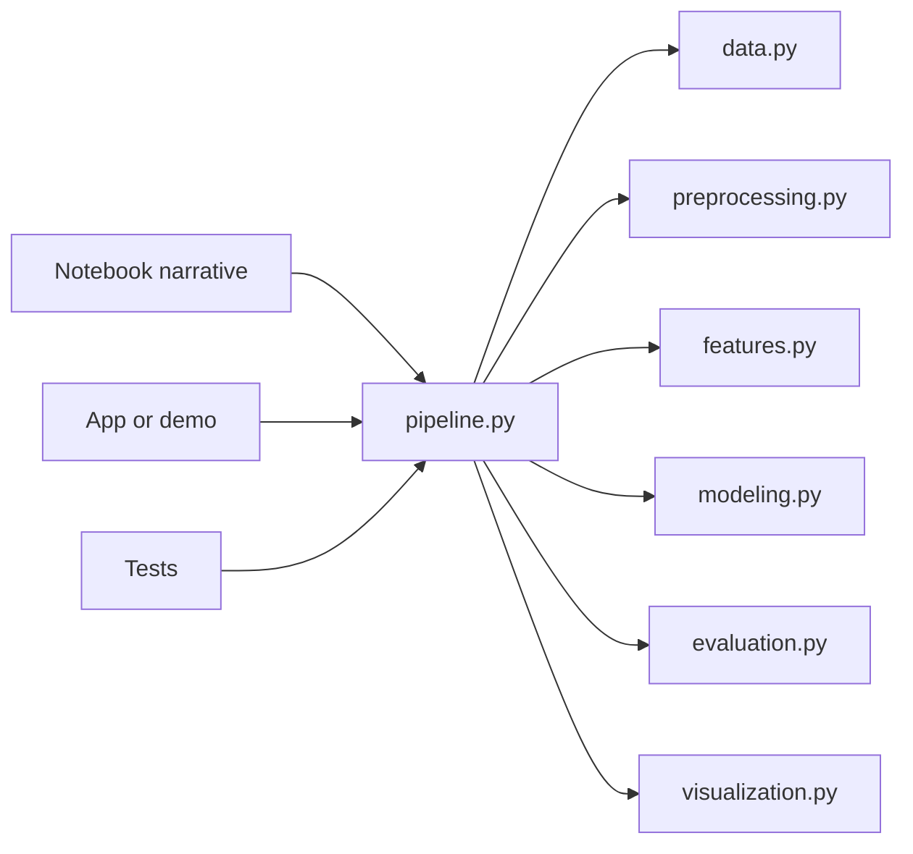

The notebook explains the reasoning. The modules hold reusable logic. The tests
protect assumptions.

## 3. Data Representation

Data is not just rows and columns. It is a measurement process encoded into a
computational form.

### Core Ideas

- **Observation**: one measured case, event, time step, transaction, experiment,
  or simulated particle.
- **Feature**: an input variable used for analysis or modeling.
- **Target**: a label or value the project attempts to predict, explain, detect,
  optimize, or simulate.
- **Schema**: the contract that says which columns exist, what types they have,
  what units they use, and which values are allowed.
- **Missingness**: missing data is an event with causes. It can be random,
  systematic, censored, delayed, or caused by instrumentation failure.
- **Lineage**: the path from raw data to processed data to features to outputs.

### Data Lineage

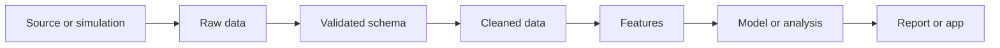

### What To Practice

- Write a schema before writing a model.
- Identify the unit of observation.
- Separate raw, interim, processed, and sample data.
- Detect duplicate keys, impossible values, missingness, and leakage.
- Explain how each output can be traced back to inputs.

## 4. Statistics And Experimental Reasoning

Statistics is how the repository distinguishes pattern from noise.

### Core Ideas

- **Population vs sample**: a sample is the observed subset; the population is
  the broader target of inference.
- **Sampling process**: how observations were collected determines what claims
  are valid.
- **Distribution**: a model of how values vary.
- **Estimator**: a rule that turns data into an estimate.
- **Bias and variance**: systematic error and sampling variability.
- **Confidence interval**: a procedure for quantifying uncertainty in an
  estimate.
- **Hypothesis test**: a formal comparison between observed data and a null
  model.
- **Experiment**: a design that controls or randomizes interventions to support
  causal reasoning.

### Statistical Reasoning Loop

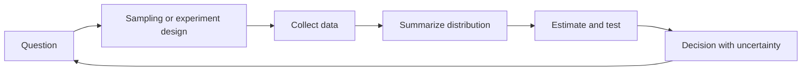

### Failure Modes

- Treating correlation as causation.
- Reporting a point estimate without uncertainty.
- Evaluating on data that influenced model or feature choices.
- Ignoring time order in forecasting.
- Comparing groups with different sampling mechanisms.

## 5. Data Analytics

Data Analytics turns data into operational understanding. It emphasizes
questions, metrics, segmentation, visualization, and communication.

### Core Ideas

- **Metric**: a quantified definition of performance or behavior.
- **Dimension**: a categorical or temporal axis used to slice a metric.
- **Cohort**: a group defined by shared start time, behavior, or condition.
- **Dashboard**: a monitoring surface for repeated decisions.
- **Narrative**: a concise explanation of what changed, why it matters, and
  what action follows.

### Analytics Flow

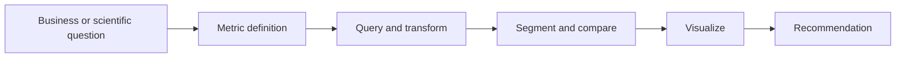

### What To Practice

- Define numerator, denominator, filters, and time window for every metric.
- Compare segments only after checking sample sizes.
- Use charts that match the question: line for time, bar for categories,
  scatter for relationships, histogram for distributions.
- Write the conclusion before adding decorative visuals.

## 6. Data Science And Machine Learning

Data Science combines statistics, domain knowledge, computation, and modeling.
Machine learning is one family of methods inside that broader practice.

### Core Ideas

- **Supervised learning**: learn a function from input features to known labels
  or target values.
- **Unsupervised learning**: find structure without a target label.
- **Feature engineering**: represent raw measurements in a form useful for
  estimation or prediction.
- **Generalization**: performance on new data, not just training data.
- **Validation**: the design used to estimate generalization.
- **Baseline**: a simple model that prevents overvaluing complexity.
- **Interpretability**: the ability to explain model behavior at a useful level.

### ML Project Flow

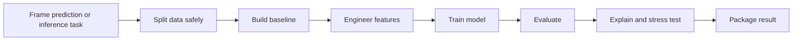

### Failure Modes

- Target leakage through future information.
- Optimizing one metric while the real cost function is different.
- Using random train-test split for time-dependent data.
- Reporting a complex model without a baseline.
- Treating high accuracy as useful when classes are imbalanced.

## 7. Data Engineering

Data Engineering makes data reliable, discoverable, validated, and reusable.
In this repository it starts lightweight, but the concepts are production
oriented.

### Core Ideas

- **Ingestion**: bringing data from external systems into a controlled zone.
- **Transformation**: converting raw data into validated, analyzable datasets.
- **Orchestration**: scheduling and ordering tasks with dependencies.
- **Data quality**: tests for completeness, uniqueness, validity, freshness,
  distribution drift, and referential integrity.
- **Partitioning**: organizing data by time, geography, entity, or other access
  pattern.
- **Idempotence**: rerunning a job should not corrupt results or duplicate data.

### Pipeline Thinking

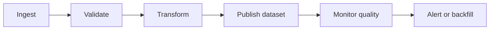

### What To Practice

- Write schemas before writing transformations.
- Make transformations deterministic.
- Separate raw data from processed data.
- Track row counts and null rates across stages.
- Design tasks so they can be rerun safely.

## 8. ML Engineering

ML Engineering turns modeling work into repeatable systems. The core issue is
not whether a model can be trained once; it is whether it can be trained,
evaluated, packaged, served, monitored, and replaced responsibly.

### Core Ideas

- **Experiment tracking**: record code version, parameters, metrics, artifacts,
  and data references.
- **Model registry**: manage model versions, stage, ownership, and lineage.
- **Serving interface**: a stable function, batch job, API, or app that uses the
  model.
- **Monitoring**: observe input drift, prediction drift, performance decay, and
  operational failures.
- **Reproducible training**: rerun training with the same data and configuration.
- **Rollback**: return to a previous model or rule when a new one fails.

### MLOps Lifecycle

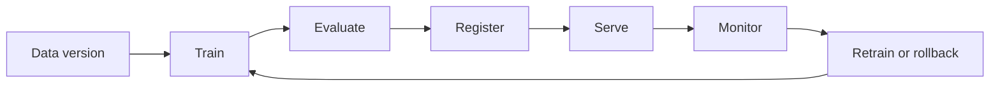

### What To Practice

- Save metrics and artifacts with the training run.
- Separate model training from inference code.
- Keep input schema checks close to serving.
- Monitor model behavior, not just server uptime.
- Document when a model should not be used.

## 9. Scientific Computing

Scientific Computing uses computation to study systems governed by mathematical
or physical structure. In this repository, it supports projects in physics,
biology, climate, energy, signal processing, and dynamic systems.

### Core Ideas

- **State variables**: quantities that describe a system at a time.
- **Parameters**: constants or tunable quantities controlling behavior.
- **Dynamics**: rules that update state through time.
- **Discretization**: approximating continuous systems with finite steps.
- **Stability**: whether numerical errors grow or remain controlled.
- **Conservation laws**: invariants such as mass, energy, probability, or charge
  that can validate simulations.
- **Sensitivity analysis**: how outputs change when inputs or parameters change.

### Simulation Loop

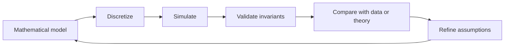

### Failure Modes

- Using a time step too large for the dynamics.
- Ignoring units and nondimensional scales.
- Believing visual smoothness proves correctness.
- Failing to test conservation or known limiting cases.
- Treating simulated data as equivalent to measured data without stating the
  approximation.

## 10. Capstone Integration

Capstones combine multiple roles. A good capstone is not just a larger notebook.
It is a system with a question, data contract, pipeline, model or analytical
method, evaluation, report, and operational limits.

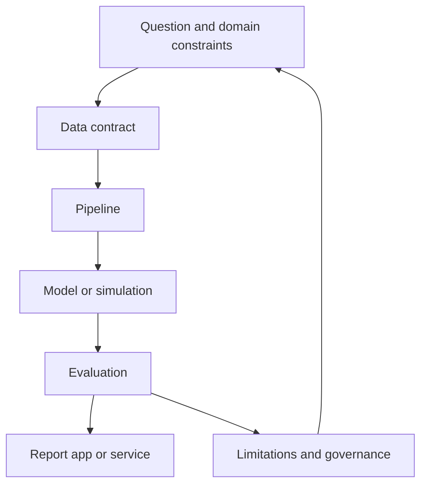

### Capstone Acceptance Standard

A capstone should answer:

- What decision or scientific question is supported?
- What data is required and what can go wrong with it?
- What assumptions control the method?
- What metric proves improvement over a baseline?
- What outputs are generated?
- What limitations, risks, and next experiments remain?

