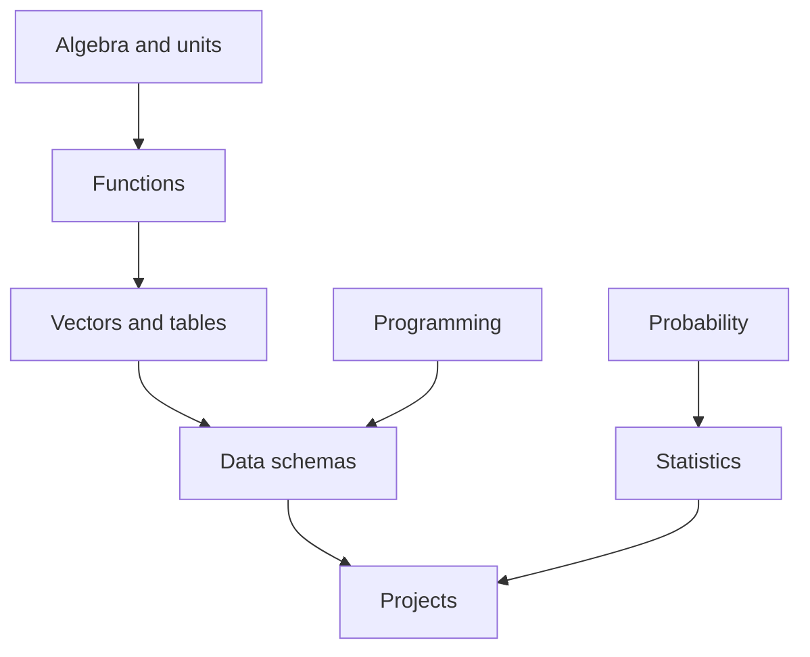

# Foundations

This module gives the minimum foundation required before specializing into
analytics, data science, data engineering, ML engineering, or scientific
computing. It should be used as a bridge for learners who need to start from
zero without reducing rigor.

## Learning Outcomes

- Explain what data, variables, observations, features, targets, and metrics
  mean.
- Translate a problem statement into a measurable question.
- Use basic algebra, functions, vectors, probability, and units to reason about
  data.
- Write small Python functions and understand how notebooks connect to modules.
- Identify uncertainty, error, missingness, and assumptions.
- Read a project README and locate its data, pipeline, notebook, and outputs.

## Foundation Stack

## Core Concepts

- **Problem framing**: convert vague intent into a question, scope, and
  measurable output.
- **Observation**: one row, event, time step, or simulated unit.
- **Variable**: a measured or computed property.
- **Feature**: a variable used as model input.
- **Target**: a value, class, event, or quantity the project predicts,
  estimates, detects, or explains.
- **Metric**: a function used to judge quality or behavior.
- **Assumption**: a condition that must be true for a result to be valid.
- **Reproducibility**: another person can rerun the workflow and understand the
  same outputs.

## First Principles Checklist

Before working on any project, answer:

1. What is the unit of observation?
2. What is measured, simulated, predicted, or optimized?
3. What assumptions are made about data collection?
4. What can go wrong with missingness, units, or time order?
5. What baseline should be compared against?
6. What output proves the project did something useful?
7. What limitation should be documented before showing the result?

## References

- [Foundational Body Of Knowledge](../../foundational_body_of_knowledge.md)
- [Bibliography And Reference Spine](../../bibliography.md)

## Projects

- `p001` [Adaptive Control for Energy Storage](../../../projects/adaptive_control_for_energy_storage/README.md) - `data_science_project`
- `p002` [Air Quality Hotspot Prediction](../../../projects/air_quality_hotspot_prediction/README.md) - `data_science_project`
- `p003` [Airplane Turbulence Pattern Mining](../../../projects/airplane_turbulence_pattern_mining/README.md) - `data_science_project`
- `p004` [Astronomical Light Curve Classifier](../../../projects/astronomical_light_curve_classifier/README.md) - `data_science_project`
- `p005` [Atmospheric Pressure Anomaly Mapper](../../../projects/atmospheric_pressure_anomaly_mapper/README.md) - `data_science_project`
- `p006` [Autonomous Vehicle Sensor Fusion Project](../../../projects/autonomous_vehicle_sensor_fusion_project/README.md) - `data_science_project`
- `p007` [Battery Degradation Modeling](../../../projects/battery_degradation_modeling/README.md) - `data_science_project`
- `p008` [Blood Flow Proxy Prediction](../../../projects/blood_flow_proxy_prediction/README.md) - `data_science_project`
- `p009` [Climate Trend Attribution Project](../../../projects/climate_trend_attribution_project/README.md) - `data_science_project`
- `p010` [Computational Topology for Data Shapes](../../../projects/computational_topology_for_data_shapes/README.md) - `scientific_computing_project`
- `p011` [Cosmic Ray Event Pattern Mining](../../../projects/cosmic_ray_event_pattern_mining/README.md) - `scientific_computing_project`
- `p012` [Crop Yield Physics-and-Data Model](../../../projects/crop_yield_physics_and_data_model/README.md) - `scientific_computing_project`
- `p013` [Data Assimilation for Environmental Systems](../../../projects/data_assimilation_for_environmental_systems/README.md) - `capstone_project`
- `p014` [Demand Forecasting for Cold Chain Logistics](../../../projects/demand_forecasting_for_cold_chain_logistics/README.md) - `data_science_project`
- `p015` [Drone Flight Stability Predictor](../../../projects/drone_flight_stability_predictor/README.md) - `data_science_project`
- `p016` [Dynamic Pricing Under Uncertainty](../../../projects/dynamic_pricing_under_uncertainty/README.md) - `analytics_project`
- `p017` [Electromagnetic Interference Pattern Detector](../../../projects/electromagnetic_interference_pattern_detector/README.md) - `data_science_project`
- `p018` [Energy Consumption Segmentation](../../../projects/energy_consumption_segmentation/README.md) - `analytics_project`
- `p019` [Energy Market Scenario Generator](../../../projects/energy_market_scenario_generator/README.md) - `analytics_project`
- `p020` [Environmental Sensor Network Placement Optimizer](../../../projects/environmental_sensor_network_placement_optimizer/README.md) - `capstone_project`
- `p021` [Epidemiological Spread Simulation](../../../projects/epidemiological_spread_simulation/README.md) - `scientific_computing_project`
- `p022` [Experimental Physics Outlier Lab](../../../projects/experimental_physics_outlier_lab/README.md) - `scientific_computing_project`
- `p023` [Experimental Reproducibility Analytics](../../../projects/experimental_reproducibility_analytics/README.md) - `analytics_project`
- `p024` [Financial Contagion Network Model](../../../projects/financial_contagion_network_model/README.md) - `data_science_project`
- `p025` [Financial Regime Change Detector](../../../projects/financial_regime_change_detector/README.md) - `data_science_project`

## Assessment Pattern

A learner should be able to explain the problem framing, run the notebook or pipeline, inspect the outputs, and state the limitations.
