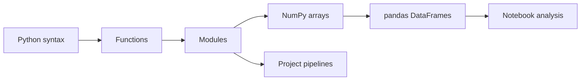

# Python Data Stack

This module teaches the practical programming foundation for the repository:
Python syntax, functions, modules, arrays, DataFrames, paths, notebooks, and
reproducible commands.

## Learning Outcomes

After this module, a learner should be able to:

- write small Python functions with explicit inputs and outputs;
- explain the difference between a list, dictionary, NumPy array, and pandas
  DataFrame;
- load, inspect, filter, aggregate, and join tabular data;
- keep notebook reasoning separate from reusable project modules;
- run repository commands with `uv` and `PYTHONPATH=src:.`;
- identify when vectorized array/DataFrame operations are preferable to Python
  loops.

## Concept Map

## Core Concepts

- **Python objects**: values with type and behavior.
- **Functions**: reusable transformations that make notebooks testable.
- **Modules**: files such as `data.py`, `features.py`, and `pipeline.py`.
- **NumPy arrays**: efficient homogeneous numerical containers.
- **pandas DataFrames**: labeled tabular structures for analytics workflows.
- **Paths**: use `pathlib.Path`, not hard-coded local absolute paths.
- **Environment**: dependencies are resolved through `pyproject.toml` and
  `uv.lock`.

## Practice Sequence

1. Write a pure function that converts raw measurements into normalized values.
2. Load a CSV from a lab dataset and inspect shape, dtypes, missingness, and
   summary statistics.
3. Convert a notebook cell into a reusable function.
4. Run the same function from a notebook and from a Python script.
5. Add a simple assertion that fails when required columns are missing.

## References

- Python tutorial: https://docs.python.org/3/tutorial/index.html
- NumPy user guide: https://numpy.org/doc/stable/user/index.html
- pandas user guide: https://pandas.pydata.org/docs/user_guide/index.html
- Scientific Python Lectures: https://lectures.scientific-python.org/

## Projects

- [Lab 01 Gradio](../../../labs/courses/lab_01_gradio/Lab1_Gradio.ipynb) -
  notebook interface fundamentals.
- [Lab 02 Statistics Pandas](../../../labs/courses/lab_02_statistics_pandas/Lab2_EstadisticaPandas.ipynb) -
  DataFrame loading, inspection, and tabular operations.
- [Lab 03 Matplotlib](../../../labs/courses/lab_03_matplotlib/Lab3_MatPlotLib.ipynb) -
  plotting fundamentals.
- [Lab 05 Missing Values](../../../labs/courses/lab_05_missing_values/Lab05_Relaciones_ValFalt_Imputacion.ipynb) -
  missingness and imputation practice.

## Assessment Pattern

A learner should be able to explain the problem framing, run the notebook or pipeline, inspect the outputs, and state the limitations.
