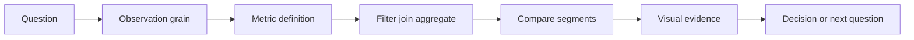

# SQL And Analytics

This module teaches how to turn data into decision-ready metrics, comparisons,
visualizations, and reports. SQL is treated as a reasoning model for selecting,
filtering, grouping, joining, and aggregating data, even when a project uses
pandas or Polars locally.

## Learning Outcomes

- Define a metric with numerator, denominator, filters, time window, and grain.
- Separate facts, dimensions, entities, and events.
- Use group-by logic to compare cohorts, segments, and time periods.
- Choose charts that match analytical questions.
- Write conclusions that state evidence, uncertainty, and limitations.

## Analytics Reasoning

## Core Concepts

- **Grain**: what one row represents.
- **Metric contract**: precise definition of a measured quantity.
- **Dimension**: category used to slice a metric.
- **Cohort**: group sharing a start condition or exposure.
- **Outlier**: a value that requires explanation, not automatic deletion.
- **Dashboard**: repeated decision surface, not a static decoration.

## Projects

- `p016` [Dynamic Pricing Under Uncertainty](../../../projects/dynamic_pricing_under_uncertainty/README.md) - `analytics_project`
- `p018` [Energy Consumption Segmentation](../../../projects/energy_consumption_segmentation/README.md) - `analytics_project`
- `p019` [Energy Market Scenario Generator](../../../projects/energy_market_scenario_generator/README.md) - `analytics_project`
- `p023` [Experimental Reproducibility Analytics](../../../projects/experimental_reproducibility_analytics/README.md) - `analytics_project`
- `p054` [Online Experiment Bayesian Analyzer](../../../projects/online_experiment_bayesian_analyzer/README.md) - `analytics_project`
- `p061` [Portfolio Risk Stress Testing Engine](../../../projects/portfolio_risk_stress_testing_engine/README.md) - `analytics_project`
- `p064` [Quantum Experiment Result Dashboard](../../../projects/quantum_experiment_result_dashboard/README.md) - `analytics_project`

## Assessment Pattern

A learner should be able to explain the problem framing, run the notebook or pipeline, inspect the outputs, and state the limitations.
