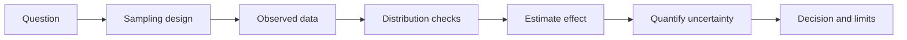

# Statistics And Experiments

This module teaches uncertainty, sampling, estimation, hypothesis testing,
experimental design, and the statistical failure modes that can make a data
project look correct while being wrong.

## Learning Outcomes

After this module, a learner should be able to:

- distinguish population, sample, parameter, statistic, and estimator;
- summarize distributions with center, spread, quantiles, and shape;
- explain sampling bias and why data collection controls valid inference;
- compute and interpret confidence intervals at a practical level;
- design a simple A/B test or observational comparison with stated limits;
- identify leakage, multiple testing risk, and correlation-causation errors.

## Statistical Workflow

## Core Concepts

- **Random variable**: a quantity whose value is uncertain.
- **Distribution**: a model or empirical summary of how values vary.
- **Estimator**: a rule for estimating an unknown quantity from data.
- **Confidence interval**: an uncertainty procedure around an estimate.
- **p-value**: evidence against a null model, not the probability that the null
  is true.
- **Power**: probability of detecting an effect when the effect exists.
- **Confounding**: a third variable influences both the input and outcome.

## Practice Sequence

1. Compute descriptive statistics for a lab CSV.
2. Plot a histogram and explain skew, outliers, and missingness.
3. Estimate a mean difference between two groups.
4. Add a confidence interval or bootstrap interval.
5. Write a limitations paragraph explaining what the data cannot prove.

## References

- OpenStax Introductory Statistics 2e:
  https://openstax.org/details/books/introductory-statistics-2e
- Foundational notes:
  [Foundational Body Of Knowledge](../../foundational_body_of_knowledge.md#4-statistics-and-experimental-reasoning)

## Projects

- [Lab 02 Statistics Pandas](../../../labs/courses/lab_02_statistics_pandas/Lab2_EstadisticaPandas.ipynb) -
  descriptive statistics and tabular exploration.
- [Lab 05 Missing Values](../../../labs/courses/lab_05_missing_values/Lab05_Relaciones_ValFalt_Imputacion.ipynb) -
  missingness patterns and imputation assumptions.
- `p023` [Experimental Reproducibility Analytics](../../../projects/experimental_reproducibility_analytics/README.md) -
  reproducibility and experimental reporting.
- `p054` [Online Experiment Bayesian Analyzer](../../../projects/online_experiment_bayesian_analyzer/README.md) -
  experimental comparison and uncertainty.

## Assessment Pattern

A learner should be able to explain the problem framing, run the notebook or pipeline, inspect the outputs, and state the limitations.
