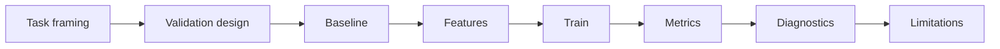

# Machine Learning

This module teaches supervised and unsupervised learning as disciplined
estimation, not as library calls. It connects features, baselines, validation,
metrics, leakage checks, interpretation, and reproducible pipelines.

## Learning Outcomes

- Frame a task as regression, classification, ranking, detection, clustering,
  or forecasting.
- Build a baseline before using a complex model.
- Choose validation that respects time, groups, leakage, and class balance.
- Interpret metrics in terms of domain cost.
- Explain model limitations and failure cases.

## Model Development Loop

## Core Concepts

- **Generalization**: performance on new cases from the intended population.
- **Loss function**: mathematical signal optimized during training.
- **Metric**: external quality measure used to judge usefulness.
- **Regularization**: constraint that reduces overfitting risk.
- **Cross-validation**: repeated validation procedure, valid only when its data
  assumptions match the problem.
- **Leakage**: using information unavailable at prediction time.

## References

- scikit-learn user guide: https://scikit-learn.org/stable/user_guide.html
- scikit-learn estimator map:
  https://scikit-learn.org/stable/machine_learning_map.html
- Stanford CS229 notes: https://cs229.stanford.edu/main_notes.pdf
- Google Machine Learning Crash Course:
  https://developers.google.com/machine-learning/crash-course

## Projects

- `p001` [Adaptive Control for Energy Storage](../../../projects/adaptive_control_for_energy_storage/README.md) - `data_science_project`
- `p002` [Air Quality Hotspot Prediction](../../../projects/air_quality_hotspot_prediction/README.md) - `data_science_project`
- `p003` [Airplane Turbulence Pattern Mining](../../../projects/airplane_turbulence_pattern_mining/README.md) - `data_science_project`
- `p004` [Astronomical Light Curve Classifier](../../../projects/astronomical_light_curve_classifier/README.md) - `data_science_project`
- `p005` [Atmospheric Pressure Anomaly Mapper](../../../projects/atmospheric_pressure_anomaly_mapper/README.md) - `data_science_project`
- `p006` [Autonomous Vehicle Sensor Fusion Project](../../../projects/autonomous_vehicle_sensor_fusion_project/README.md) - `data_science_project`
- `p007` [Battery Degradation Modeling](../../../projects/battery_degradation_modeling/README.md) - `data_science_project`
- `p008` [Blood Flow Proxy Prediction](../../../projects/blood_flow_proxy_prediction/README.md) - `data_science_project`
- `p009` [Climate Trend Attribution Project](../../../projects/climate_trend_attribution_project/README.md) - `data_science_project`
- `p014` [Demand Forecasting for Cold Chain Logistics](../../../projects/demand_forecasting_for_cold_chain_logistics/README.md) - `data_science_project`
- `p015` [Drone Flight Stability Predictor](../../../projects/drone_flight_stability_predictor/README.md) - `data_science_project`
- `p017` [Electromagnetic Interference Pattern Detector](../../../projects/electromagnetic_interference_pattern_detector/README.md) - `data_science_project`
- `p024` [Financial Contagion Network Model](../../../projects/financial_contagion_network_model/README.md) - `data_science_project`
- `p025` [Financial Regime Change Detector](../../../projects/financial_regime_change_detector/README.md) - `data_science_project`
- `p026` [Financial Volatility Surface Predictor](../../../projects/financial_volatility_surface_predictor/README.md) - `data_science_project`
- `p028` [Fraud Detection in Scientific Grant Data](../../../projects/fraud_detection_in_scientific_grant_data/README.md) - `data_science_project`
- `p031` [High-Dimensional Feature Selection Lab](../../../projects/high_dimensional_feature_selection_lab/README.md) - `data_science_project`
- `p032` [High-Frequency Trading Microstructure Analyzer](../../../projects/high_frequency_trading_microstructure_analyzer/README.md) - `data_science_project`
- `p033` [Hospital Queue Dynamics Analyzer](../../../projects/hospital_queue_dynamics_analyzer/README.md) - `data_science_project`
- `p035` [Human Gait Stability Analysis](../../../projects/human_gait_stability_analysis/README.md) - `data_science_project`
- `p036` [Human Mobility Pattern Clustering](../../../projects/human_mobility_pattern_clustering/README.md) - `data_science_project`
- `p037` [Hydrological Flood Risk Forecasting](../../../projects/hydrological_flood_risk_forecasting/README.md) - `data_science_project`
- `p038` [Industrial Sound Event Detector](../../../projects/industrial_sound_event_detector/README.md) - `data_science_project`
- `p042` [Large-Scale Sensor Missing Data Imputation](../../../projects/large_scale_sensor_missing_data_imputation/README.md) - `data_science_project`
- `p044` [Magnetic Field Sensor Reconstruction](../../../projects/magnetic_field_sensor_reconstruction/README.md) - `data_science_project`

## Assessment Pattern

A learner should be able to explain the problem framing, run the notebook or pipeline, inspect the outputs, and state the limitations.
