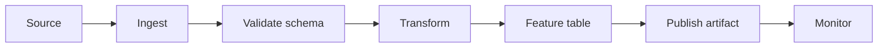

# Data Pipelines

This module teaches how data moves from source to validated datasets and
project outputs. The emphasis is deterministic transformation, explicit schemas,
lineage, idempotence, and testable stages.

## Learning Outcomes

- Split a workflow into ingestion, validation, transformation, feature, and
  publication stages.
- Define schema and quality checks before modeling.
- Explain idempotence and why reruns must be safe.
- Track row counts, null rates, uniqueness, and freshness across stages.
- Sketch dependencies as a DAG.

## Pipeline Architecture

## Core Concepts

- **Data contract**: schema, units, keys, and freshness expectations.
- **DAG**: directed acyclic graph of tasks and dependencies.
- **Idempotence**: rerunning does not duplicate or corrupt outputs.
- **Backfill**: intentional recomputation over historical partitions.
- **Lineage**: trace from output back to source.
- **Observability**: evidence that a pipeline ran correctly.

## Projects

- `p039` [Large-Scale Astronomy Catalog Linker](../../../projects/large_scale_astronomy_catalog_linker/README.md) - `data_engineering_project`
- `p040` [Large-Scale Log Compression and Analytics](../../../projects/large_scale_log_compression_and_analytics/README.md) - `data_engineering_project`
- `p043` [Large-Scale Text Mining of Scientific Literature](../../../projects/large_scale_text_mining_of_scientific_literature/README.md) - `data_engineering_project`
- `p049` [Network Traffic Anomaly Detection](../../../projects/network_traffic_anomaly_detection/README.md) - `data_engineering_project`
- `p076` [Scientific Data Platform for Multi-Modal Experiments](../../../projects/scientific_data_platform_for_multi_modal_experiments/README.md) - `data_engineering_project`
- `p077` [Scientific Experiment Metadata Knowledge Graph](../../../projects/scientific_experiment_metadata_knowledge_graph/README.md) - `data_engineering_project`
- `p092` [Structural Health Monitoring Platform](../../../projects/structural_health_monitoring_platform/README.md) - `data_engineering_project`

## Assessment Pattern

A learner should be able to explain the problem framing, run the notebook or pipeline, inspect the outputs, and state the limitations.
