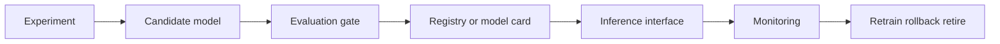

# MLOps And Serving

This module teaches the lifecycle around machine learning systems: experiment
tracking, model packaging, inference contracts, deployment surfaces, monitoring,
and rollback. In this repository, the first implementation surface is local and
portfolio-friendly; the concepts are production-oriented.

## Learning Outcomes

- Record parameters, metrics, artifacts, code version, and data assumptions.
- Separate training code from inference code.
- Define an input schema for prediction.
- Explain model versioning and registry concepts.
- Monitor drift, performance decay, and operational errors.
- Describe when to retrain, rollback, or retire a model.

## Serving Lifecycle

## Core Concepts

- **Experiment tracking**: durable record of training context and outputs.
- **Model registry**: versioned model management with lineage.
- **Inference contract**: accepted inputs, outputs, errors, and latency
  expectations.
- **Data drift**: input distribution changes.
- **Concept drift**: relationship between inputs and target changes.
- **Model card**: documented intended use, limitations, and risks.

## References

- MLflow documentation: https://mlflow.org/docs/latest/
- MLflow tracking: https://mlflow.org/docs/latest/ml/tracking/
- MLflow model registry: https://mlflow.org/docs/latest/ml/model-registry/

## Projects

- `p034` [Human Activity Recognition from Wearables](../../../projects/human_activity_recognition_from_wearables/README.md) - `ml_engineering_project`
- `p041` [Large-Scale Recommendation for Learning Paths](../../../projects/large_scale_recommendation_for_learning_paths/README.md) - `ml_engineering_project`
- `p067` [Real-Time Manufacturing Yield Dashboard](../../../projects/real_time_manufacturing_yield_dashboard/README.md) - `ml_engineering_project`
- `p068` [Recommender System for Scientific Papers](../../../projects/recommender_system_for_scientific_papers/README.md) - `ml_engineering_project`
- `p078` [Scientific Image Segmentation Benchmark](../../../projects/scientific_image_segmentation_benchmark/README.md) - `ml_engineering_project`
- `p082` [Sensor Drift Detection in Industrial Systems](../../../projects/sensor_drift_detection/README.md) - `ml_engineering_project`
- `p087` [Smart Grid Fault Localization](../../../projects/smart_grid_fault_localization/README.md) - `ml_engineering_project`
- `p100` [Wind Turbine Failure Early Warning System](../../../projects/wind_turbine_failure_early_warning_system/README.md) - `ml_engineering_project`

## Assessment Pattern

A learner should be able to explain the problem framing, run the notebook or pipeline, inspect the outputs, and state the limitations.
