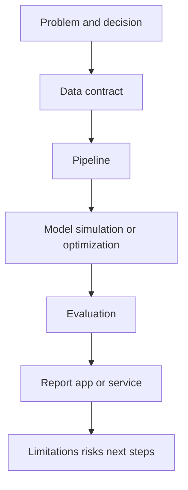

# Capstone Systems

This module integrates the repository's roles into end-to-end systems. A
capstone should combine problem framing, data contracts, pipelines, modeling or
simulation, evaluation, reporting, and operational limitations.

## Learning Outcomes

- Translate a real problem into a system boundary and success metric.
- Combine analytics, data science, data engineering, ML engineering, and
  scientific computing where appropriate.
- Define interfaces between data, pipeline, model, report, and app.
- Validate correctness with tests, smoke checks, and documented assumptions.
- Present limitations honestly and propose the next experiment.

## Capstone System

## Required Evidence

- A project README explaining the problem, data, method, outputs, and limits.
- A reproducible command or notebook.
- Metadata in `project.yaml`.
- At least one validation or smoke check.
- A clear statement of what the project does not prove.

## Projects

- `p013` [Data Assimilation for Environmental Systems](../../../projects/data_assimilation_for_environmental_systems/README.md) - `capstone_project`
- `p020` [Environmental Sensor Network Placement Optimizer](../../../projects/environmental_sensor_network_placement_optimizer/README.md) - `capstone_project`
- `p071` [Renewable Energy Mix Optimizer](../../../projects/renewable_energy_mix_optimizer/README.md) - `capstone_project`
- `p085` [Smart City Noise Map Generator](../../../projects/smart_city_noise_map_generator/README.md) - `capstone_project`
- `p086` [Smart Farming Irrigation Optimizer](../../../projects/smart_farming_irrigation_optimizer/README.md) - `capstone_project`
- `p093` [Supply Chain as a Dynamic Network](../../../projects/supply_chain_as_a_dynamic_network/README.md) - `capstone_project`
- `p095` [Traffic Flow as a Physical System](../../../projects/traffic_flow_as_a_physical_system/README.md) - `capstone_project`
- `p097` [Warehouse Robotics Path Optimization](../../../projects/warehouse_robotics_path_optimization/README.md) - `capstone_project`

## Assessment Pattern

A learner should be able to explain the problem framing, run the notebook or pipeline, inspect the outputs, and state the limitations.
