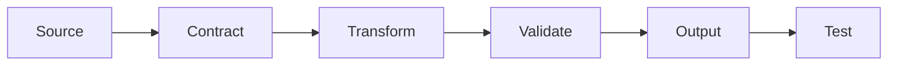

# Rubrics

Evaluation rubrics for notebooks, pipelines, reports, and portfolio readiness.

## Universal Project Rubric

| Dimension | Strong Evidence | Weak Evidence |
| --- | --- | --- |
| Problem framing | Clear question, scope, decision/use case, and success metric | Vague topic with no measurable goal |
| Data contract | Schema, units, keys, missingness, provenance, and leakage risks documented | Data appears only in notebook cells |
| Method | Baseline and main method are explained with assumptions | Model/library is named without reasoning |
| Evaluation | Metrics match the task and include diagnostics or uncertainty | Single score without interpretation |
| Reproducibility | Command, notebook, dependency path, and seed/path assumptions are clear | Works only in the author's session |
| Communication | Outputs, limitations, and next steps are explicit | Charts are shown without conclusions |

## Notebook Rubric

- Starts with a question and expected artifact.
- Loads data through project modules when possible.
- Shows schema, missingness, distributions, and representative rows.
- Explains transformations before modeling.
- Reports metrics with interpretation.
- Ends with limitations and suggested next experiment.

## Pipeline Rubric

- Inputs and outputs are explicit.
- Stages are separable and testable.
- Errors are actionable.
- Reruns are deterministic or documented as stochastic with seeds.
- Outputs are stored in the correct artifact lifecycle location.

## Portfolio Readiness Rubric

A project is portfolio-ready when a reviewer can answer, within five minutes:

1. What problem is being solved?
2. What data or simulation is used?
3. What method is applied?
4. What result or artifact is produced?
5. How can the workflow be rerun?
6. What are the limitations?
