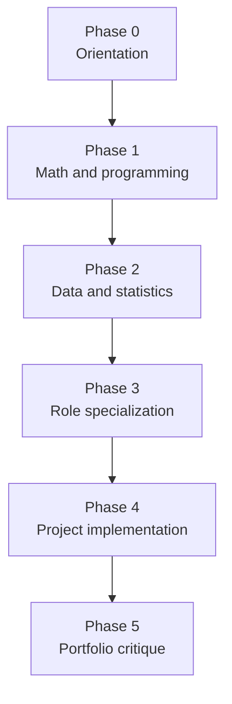

# Study Plan

This study plan organizes the curriculum into phases. It is intentionally
modular: learners can enter through a role track, but the foundation remains
shared across analytics, data science, data engineering, ML engineering, and
scientific computing.

## Phase Map

## Phase 0: Orientation

Read:

- [Curriculum README](README.md)
- [Foundational Body Of Knowledge](foundational_body_of_knowledge.md)
- [Learning Paths](../docs/learning_paths.md)

Outcome:

- You can explain the repository's purpose, project identity model, and learning
  tracks.

## Phase 1: Math And Programming Foundations

Study:

- algebra, functions, vectors, matrices, units, probability;
- Python functions, modules, notebooks, paths, NumPy arrays, pandas DataFrames.

Practice:

- complete a lab notebook under `labs/courses/`;
- convert one notebook transformation into a reusable function;
- explain a metric as a mathematical function of data.

Evidence:

- short notes on observation, variable, feature, target, metric, and assumption.

## Phase 2: Data And Statistics

Study:

- schema, missingness, data lineage, descriptive statistics, uncertainty,
  sampling, experiments, and leakage.

Practice:

- audit one project dataset or simulated dataset;
- compute summary statistics and identify missingness;
- write a limitations paragraph before modeling.

Evidence:

- data quality checklist and uncertainty note.

## Phase 3: Role Specialization

Choose one primary track:

- Data Analytics
- Data Science
- Data Engineering
- ML Engineering
- Scientific Computing

Practice:

- follow the track README;
- complete the listed module checkpoints;
- choose one representative project and one stretch project.

Evidence:

- track-specific assessment artifact from `curriculum/assessments/`.

## Phase 4: Project Implementation

For each selected project:

1. Read `project.yaml`.
2. Read the project README.
3. Run the documented command.
4. Open the notebook.
5. Inspect data, method, outputs, and limitations.
6. Improve one explanation, test, or diagnostic.

Evidence:

- reproducible command output;
- notebook or report artifact;
- documented limitation.

## Phase 5: Portfolio Critique

Review the project like a technical interviewer:

- What problem does it solve?
- Why does the method fit?
- What data risk remains?
- What metric matters?
- What would break at larger scale?
- What would you do next?

The final portfolio standard is not perfection. It is transparent, reproducible
work with defensible assumptions and a clear path for improvement.
