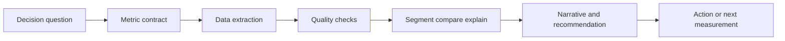

# Data Analytics

## Learning Goal

Build practical capability in data analytics through reusable notebooks, project READMEs, and portfolio-grade implementations.

Data Analytics is the discipline of turning observed data into clear,
decision-ready evidence. The analytical thinker asks: what changed, for whom,
how much, compared with what baseline, and what decision follows?

## Role Mental Model

## Core Competencies

- Translate vague business or scientific questions into measurable metrics.
- Define grain, filters, numerator, denominator, and time window.
- Use tabular reasoning: select, filter, join, group, aggregate, sort, and
  reshape.
- Distinguish descriptive analytics from causal claims.
- Communicate uncertainty, missingness, and limitations without hiding them.
- Design charts around questions rather than decoration.

## Prerequisites

- Python fundamentals.
- Basic command-line usage.
- Ability to run `uv sync` and notebooks from the repository root.

## Recommended Module Order

- `00_foundations` - Foundations
- `01_python_data_stack` - Python Data Stack
- `02_sql_and_analytics` - SQL And Analytics
- `03_statistics_and_experiments` - Statistics And Experiments
- `09_capstone_systems` - Capstone Systems

## Checkpoints

1. Explain the grain of a dataset and identify its primary entities.
2. Define three metrics with exact formulas and known failure modes.
3. Build a segmented comparison and state whether the comparison is fair.
4. Produce one chart per analytical question.
5. Write a one-page decision memo with evidence, caveats, and next action.

## Exit Standard

A learner completes this track when they can take a project README, inspect the
data or simulated data, define defensible metrics, generate a concise report,
and explain what cannot be concluded from the evidence.

## Representative Projects

- `p013` [Data Assimilation for Environmental Systems](../../../projects/data_assimilation_for_environmental_systems/README.md) - `advanced`, `capstone_project`
- `p016` [Dynamic Pricing Under Uncertainty](../../../projects/dynamic_pricing_under_uncertainty/README.md) - `beginner`, `analytics_project`
- `p018` [Energy Consumption Segmentation](../../../projects/energy_consumption_segmentation/README.md) - `beginner`, `analytics_project`
- `p019` [Energy Market Scenario Generator](../../../projects/energy_market_scenario_generator/README.md) - `beginner`, `analytics_project`
- `p020` [Environmental Sensor Network Placement Optimizer](../../../projects/environmental_sensor_network_placement_optimizer/README.md) - `advanced`, `capstone_project`
- `p023` [Experimental Reproducibility Analytics](../../../projects/experimental_reproducibility_analytics/README.md) - `beginner`, `analytics_project`
- `p054` [Online Experiment Bayesian Analyzer](../../../projects/online_experiment_bayesian_analyzer/README.md) - `intermediate`, `analytics_project`
- `p061` [Portfolio Risk Stress Testing Engine](../../../projects/portfolio_risk_stress_testing_engine/README.md) - `intermediate`, `analytics_project`
- `p064` [Quantum Experiment Result Dashboard](../../../projects/quantum_experiment_result_dashboard/README.md) - `intermediate`, `analytics_project`
- `p071` [Renewable Energy Mix Optimizer](../../../projects/renewable_energy_mix_optimizer/README.md) - `advanced`, `capstone_project`
- `p085` [Smart City Noise Map Generator](../../../projects/smart_city_noise_map_generator/README.md) - `advanced`, `capstone_project`
- `p086` [Smart Farming Irrigation Optimizer](../../../projects/smart_farming_irrigation_optimizer/README.md) - `advanced`, `capstone_project`
- `p093` [Supply Chain as a Dynamic Network](../../../projects/supply_chain_as_a_dynamic_network/README.md) - `advanced`, `capstone_project`
- `p095` [Traffic Flow as a Physical System](../../../projects/traffic_flow_as_a_physical_system/README.md) - `advanced`, `capstone_project`
- `p097` [Warehouse Robotics Path Optimization](../../../projects/warehouse_robotics_path_optimization/README.md) - `advanced`, `capstone_project`

## Notebook Surface

Use each project README as the entry point, then open the linked notebook in `projects/<slug>/notebooks/` for guided exploration.
