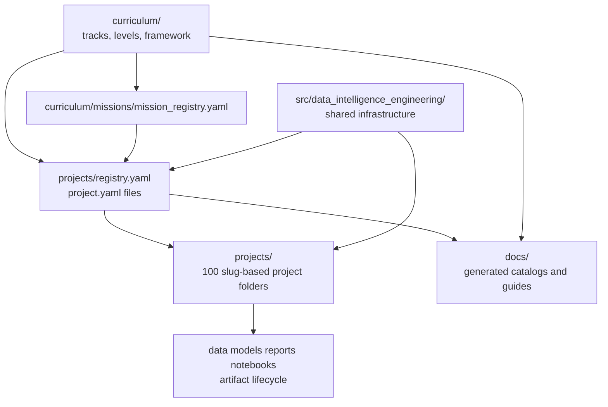

# Repository Architecture

The repository follows a teaching-first portfolio architecture. It is designed
to teach Data Analytics, Data Science, Data Engineering, ML Engineering, and
Scientific Computing through 100 self-contained projects plus five independent
`L01`-`L10` learning tracks.

## Architecture Model

## Design Decisions

- Physical project paths stay slug-based, for example
  `projects/sensor_drift_detection/`.
- Stable IDs `p001`-`p100` live in metadata and generated catalogs.
- Aliases are registry-based, not symlink-based and not duplicated folders.
- README files and notebooks are the primary teaching surface.
- Shared core code belongs in `src/data_intelligence_engineering/`.
- Project-specific science, modeling, simulation, and business logic stays
  inside each project.
- DVC is not required in this phase; artifact directories are DVC-ready later.

## Project Metadata

Every project owns a `project.yaml` file with:

- stable ID and slug;
- tracks, difficulty, domain, skills, template, and maturity;
- data policy and artifact types;
- canonical run and test commands.

`projects/registry.yaml` is the repository-level index. Tooling should resolve
both `p001` and `sensor_drift_detection` through
`data_intelligence_engineering.catalog.resolve_project`.

## Teaching Layer

`curriculum/` is the educational map. It does not duplicate projects. It links
role-based tracks and reusable modules to project IDs.

Tracks:

- Data Analytics
- Data Science
- Data Engineering
- ML Engineering
- Scientific Computing

Each track has 10 levels. The current implementation establishes the full
directory contract for `L01`-`L10` and provides central L01 notebooks for every
track. Mission definitions live in `curriculum/missions/mission_registry.yaml`
and connect level objectives to project IDs.

## Template Families

The repository uses role-specific templates:

- `analytics_project`
- `data_science_project`
- `data_engineering_project`
- `ml_engineering_project`
- `scientific_computing_project`
- `capstone_project`

This avoids forcing analytics dashboards, ML services, data pipelines, and
scientific simulations into the same exact project shape.
